# Antarbodh Yoga & Healing

**Website and online booking system for a yoga therapy and holistic healing studio in Kathmandu**

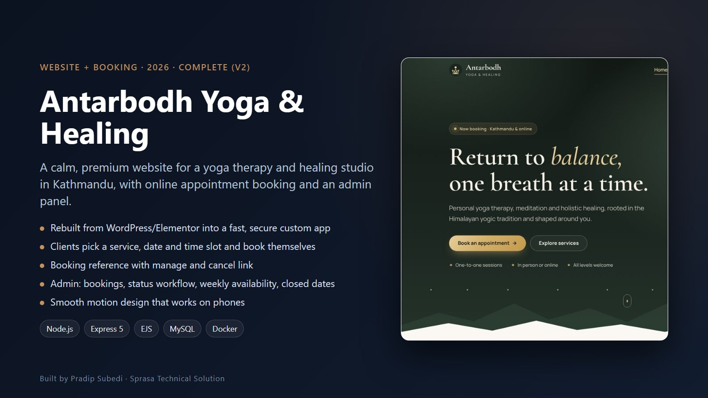

| | |
|---|---|
| **Client** | Antarbodh Yoga & Healing, Kathmandu |
| **Type** | Business website + appointment booking + admin panel |
| **Year** | 2026 |
| **Status** | Complete (version 2) |
| **Platform** | Web (desktop and mobile) |

## The client's problem

The studio's first site was built in WordPress with Elementor. It was slow, hard to keep secure, and took bookings by phone only. The owner wanted a site that feels as calm as the studio does, and lets clients book a session without calling.

## What we built

A rebuild from scratch as a fast custom web app. Clients book online, and the studio manages every booking from its own admin panel.

### Home page
A dark forest hero with a slow breathing animation sets the tone. Services, the teacher's story and a booking button follow.

| Home (hero) | Full home page |
|---|---|
| 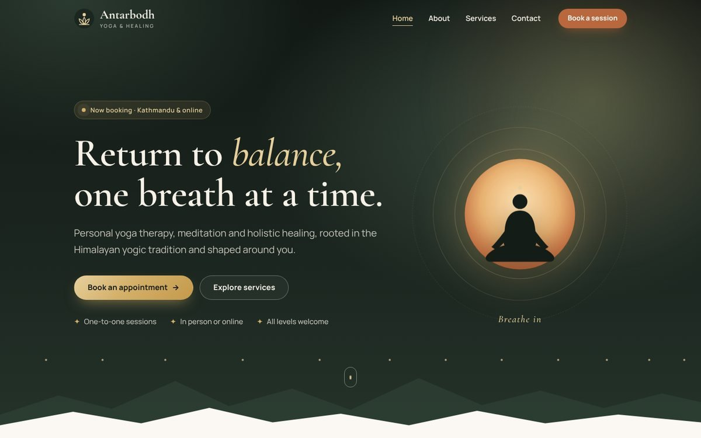 | 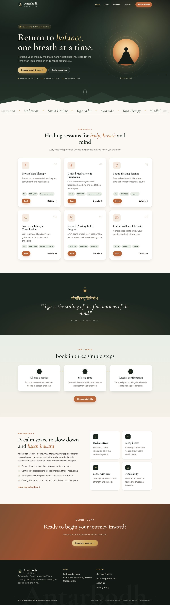 |

### Services and booking
Each service has its own page with price and duration. The booking form shows only free time slots for the chosen date. After booking, the client gets a reference number and a link to manage or cancel.

| Services | Service detail |
|---|---|
| 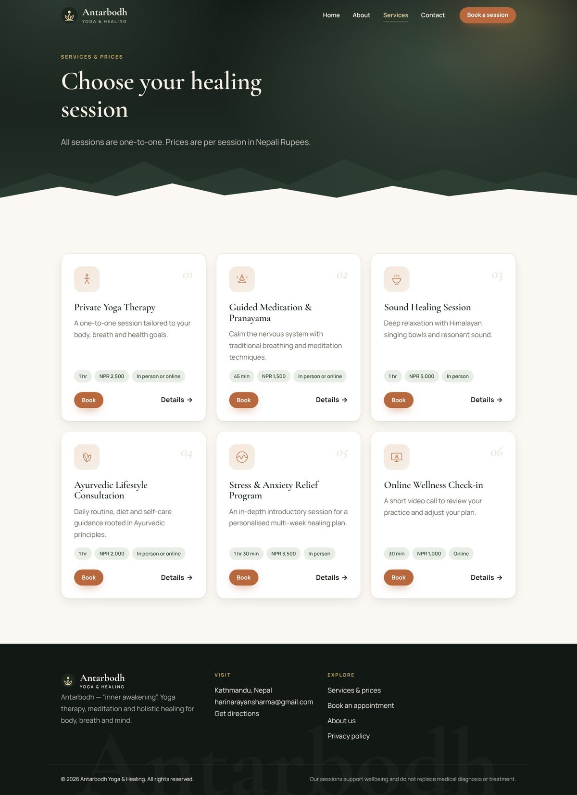 | 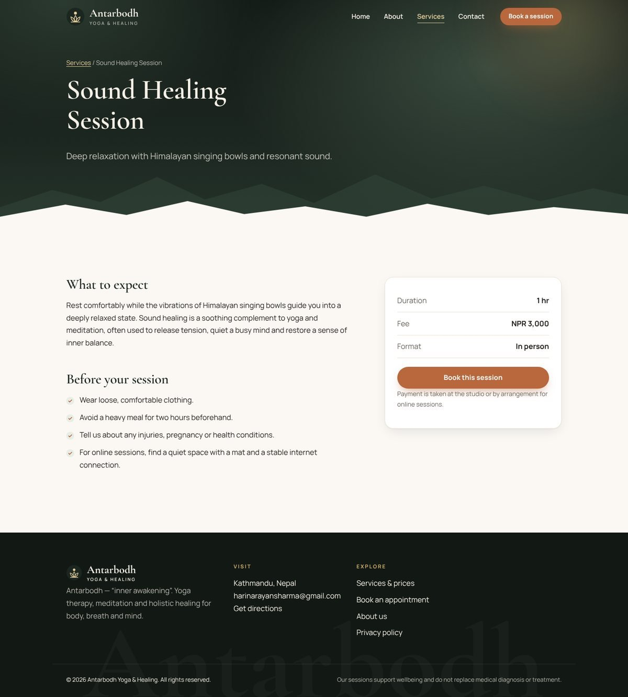 |

| Booking | Booking confirmed |
|---|---|
| 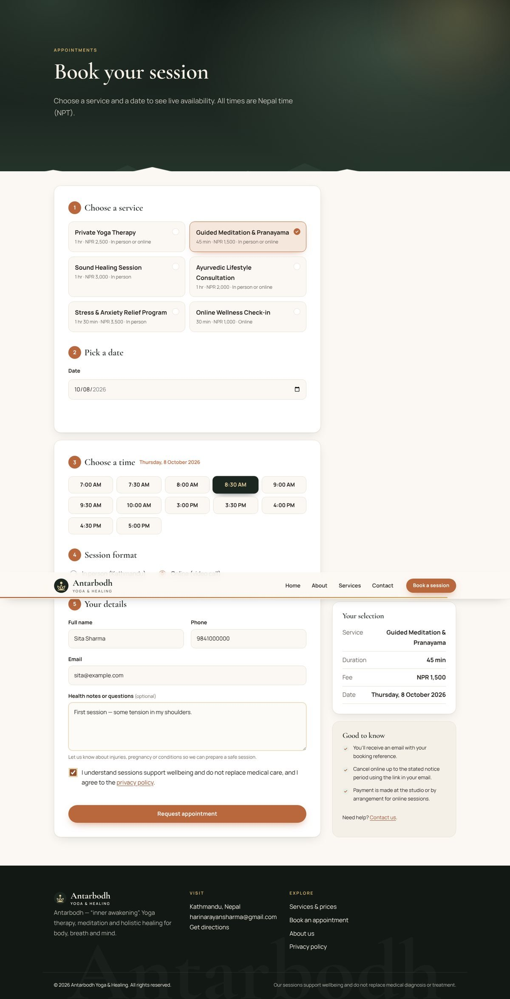 | 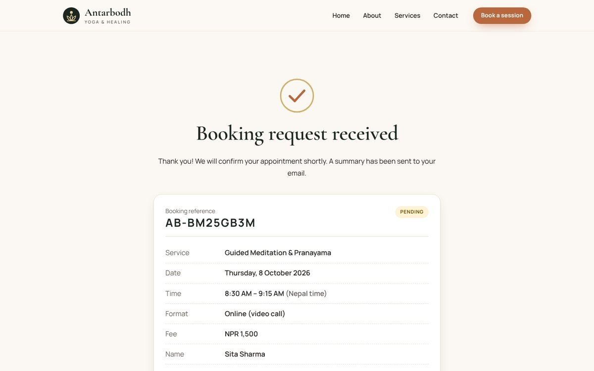 |

### About, contact and mobile

| About | Contact |
|---|---|
| 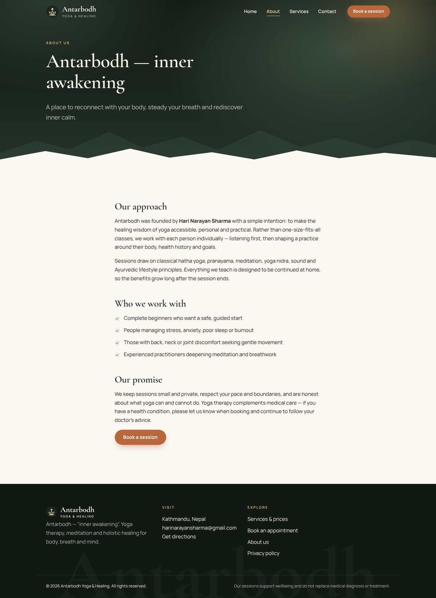 | 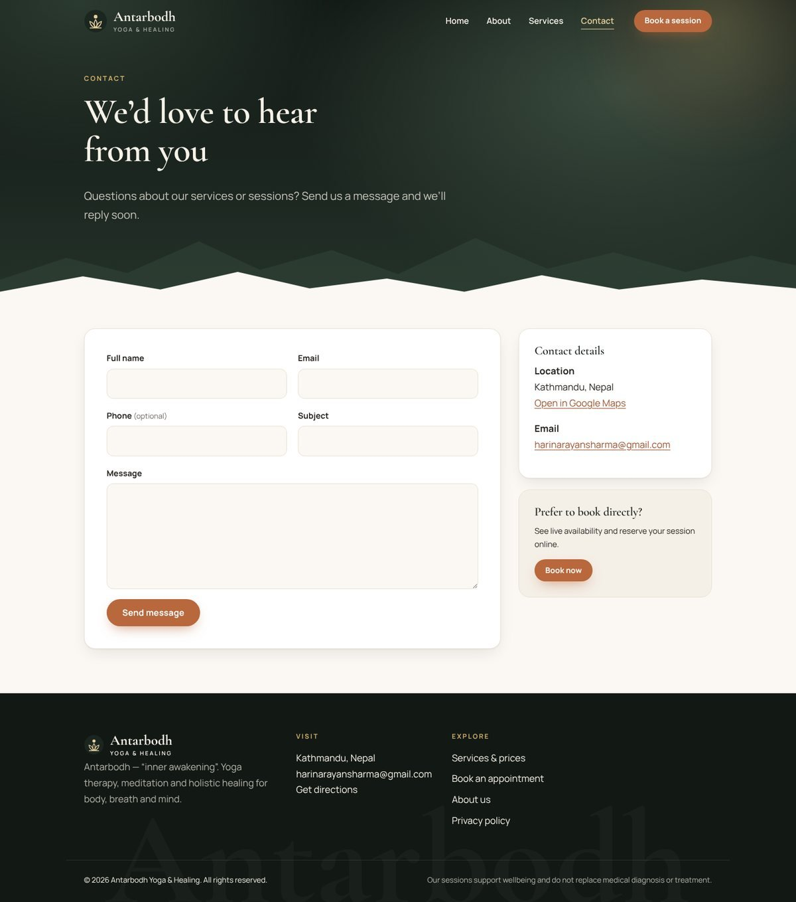 |

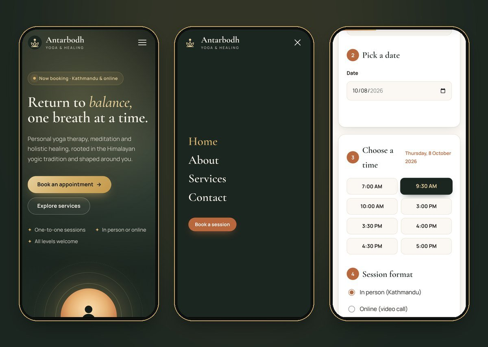

### Admin panel
The studio sees today's bookings at a glance, moves each one through its status, and sets the weekly schedule and closed dates that drive the free slots.

| Dashboard | Bookings |
|---|---|
| 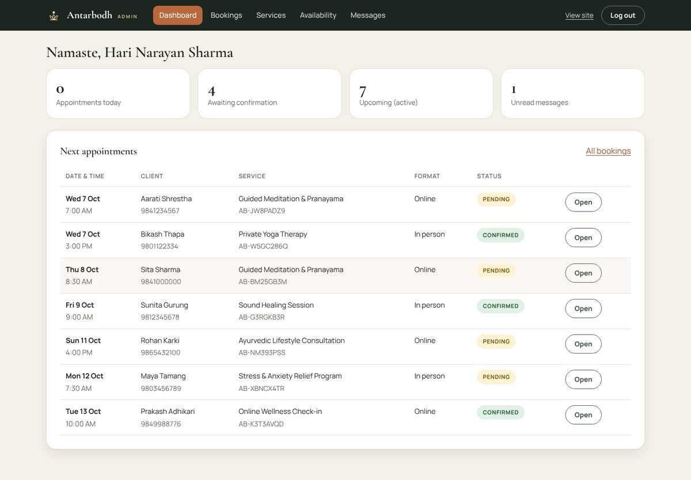 | 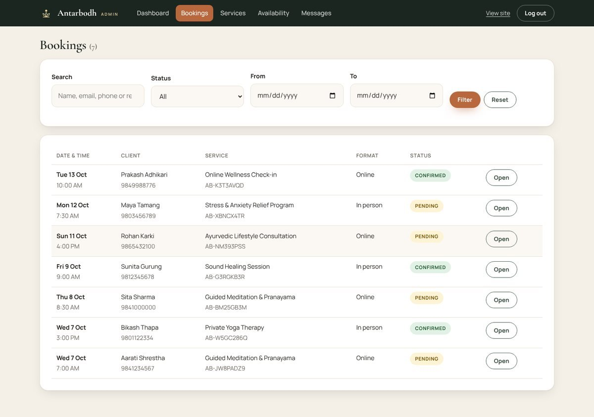 |

| Booking detail | Availability |
|---|---|
| 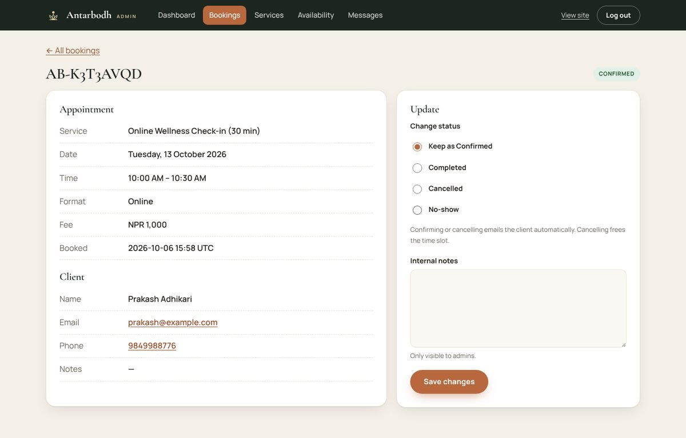 | 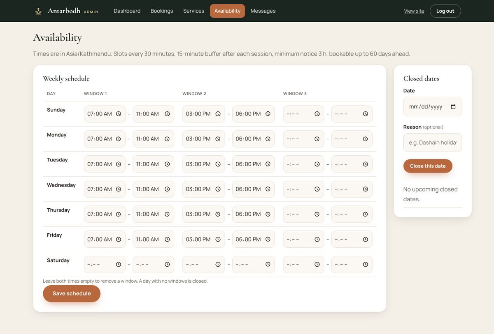 |

## Key features

- Online booking with live time slots, so two clients can't book the same time
- Booking reference and self-service manage/cancel link
- Service pages with prices, durations and descriptions
- Admin: booking list with filters, status workflow, services, weekly hours and closed dates
- Calm motion design that respects "reduce motion" settings
- Mobile first, with a full-screen menu and an easy time-slot picker
- 42 automated tests; ships with Docker for easy hosting

## Technology

| Area | Used |
|---|---|
| Backend | Node.js 22, Express 5 |
| Pages | Server-rendered EJS templates |
| Database | MySQL 8 |
| Hosting | Docker, any Node host or VPS |

## Results for the client

- Bookings come in at any hour without a phone call
- The site loads far faster than the old WordPress build
- The owner changes hours and closed days without help

---

**Built by Pradip Subedi · Sprasa Technical Solution**
Want something similar for your business? [Get in touch](../README.md#contact).
