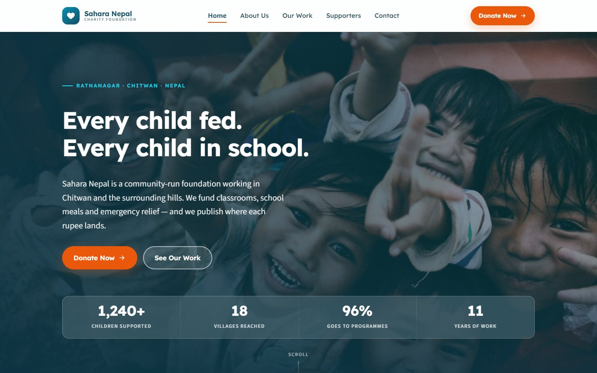
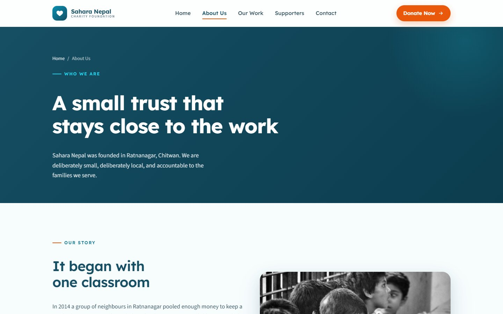
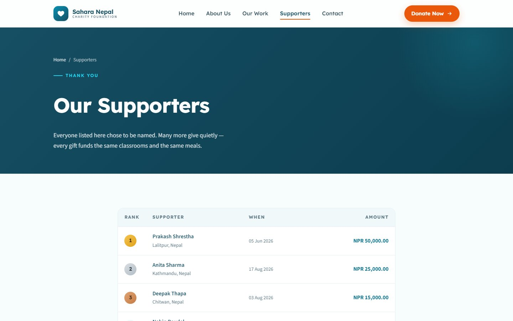
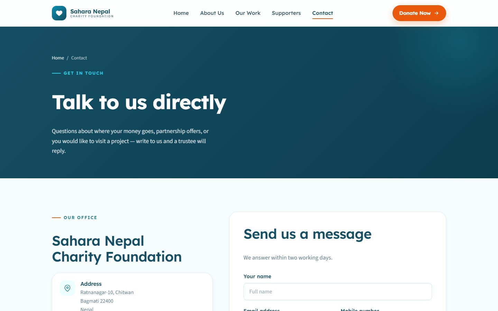
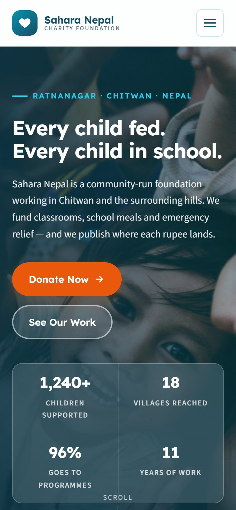
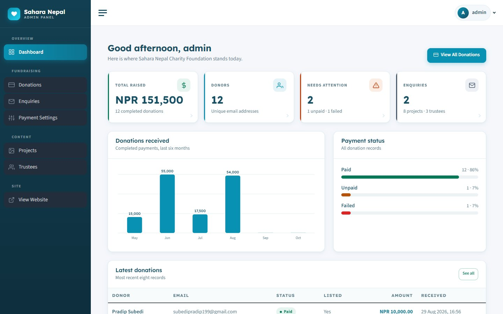
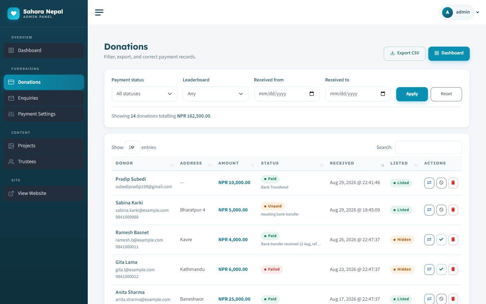

# Sahara Nepal Charity Foundation

**Donation website and donor management for a community charity**

| | |
|---|---|
| **Client** | Sahara Nepal Charity Foundation, Ratnanagar, Chitwan (community trust) |
| **Type** | Non-profit website + online donations + admin |
| **Year** | 2026 |
| **Status** | Complete |
| **Platform** | Web (desktop and mobile) |

## The client's problem

A small trust that funds classrooms, meals and emergency relief needed to accept donations online, show donors where the money goes, and thank supporters publicly, all without a full-time web person.

## What we built

A warm, trustworthy website with a clear "Donate Now" path, and an admin panel for the trustees.

| Home | About the trust |
|---|---|
|  |  |

| Supporters board | Contact |
|---|---|
|  |  |

| On a phone | Admin dashboard |
|---|---|
|  |  |

### Managing donations

## Key features

- Donation form with country, state and city, a minimum amount and card payment
- Impact figures on the home page (children supported, villages reached)
- A public supporters board; each donor chooses whether to be listed
- Projects ("Our Work"), trustees and photo albums
- Contact form with an enquiries inbox
- Admin dashboard: total raised, number of donors, payment status, monthly chart, latest donations
- Donations list with filters, status updates, listing control and CSV export
- Payment gateway settings with a "test connection" button

## Technology

| Area | Used |
|---|---|
| Backend | Laravel (PHP), MySQL |
| Payments | Stripe, with webhooks |
| Frontend | Blade templates, Bootstrap, CKEditor for content |

---

*Donor names and amounts in the screenshots are demo data.*

**Built by Pradip Subedi · Sprasa Technical Solution**
Want something similar for your organisation? [Get in touch](../README.md#contact).
