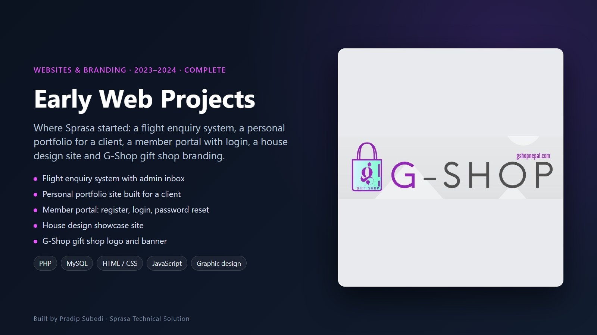
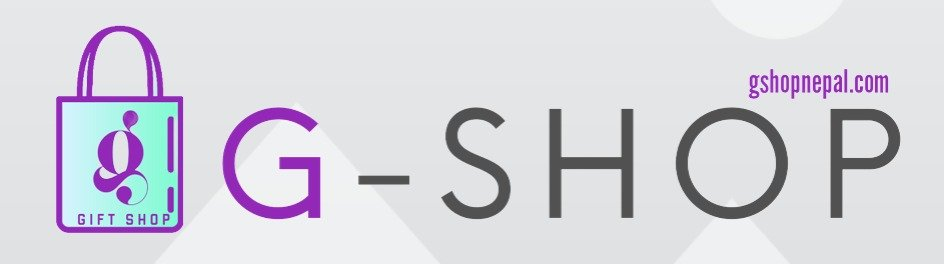

# Early Web Projects

**Where Sprasa started: first client sites, systems and branding**

| | |
|---|---|
| **Clients** | Small businesses and individuals in Chitwan |
| **Type** | Websites, small web systems and branding |
| **Years** | 2023–2024 |
| **Status** | Complete |

These first projects taught us how small businesses actually work. Several grew into the larger products in this portfolio.

## Flight Inquiry System

A travel agency website where customers send a flight enquiry (route, dates, passengers) instead of calling. Every enquiry lands in an admin inbox for the agency to follow up.

- Public enquiry form with validation
- Admin panel listing every enquiry
- PHP and MySQL, easy to host

This idea later grew into [Sprasa Travel](../sprasa-travel/), a full online booking platform with payments and e-tickets.

## Personal portfolio for a client

A personal portfolio website built for an individual client, with about, contact and profile pages, a public contact card, and a small database so the owner can update their details.

## Member portal

A website with a members area: registration, email confirmation, login, logout and password reset, plus about, contact and privacy policy pages.

## House design site

A showcase site for house designs with a simple content system for adding new designs and pages.

## G-Shop gift shop branding

Logo and banner design for G-Shop, a gift shop ([gshopnepal.com](https://gshopnepal.com)).

---

**Built by Pradip Subedi · Sprasa Technical Solution**
[Get in touch](../README.md#contact).
