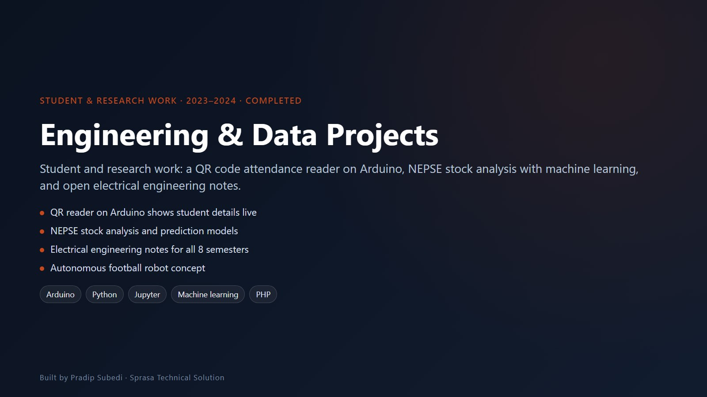

# Engineering & Data Projects

**Student and research work in electronics, data science and teaching**

| | |
|---|---|
| **Institution** | United Technical College, Bharatpur (Pokhara University) |
| **Type** | Student, club and research projects |
| **Years** | 2023–2024 |
| **Status** | Completed |

## QR Code Reader (Arduino)

An Arduino project built at United Technical College. A QR code reader connected to an Arduino scans a student's card, and a web page shows the student's name and roll number in real time. It is the base for quick attendance and entry checks.

- Arduino Uno + QR / barcode scanner module
- Live web page that reads the serial port and updates instantly
- PHP validator and a CSV record of scans

## NEPSE Stock Analysis (Machine Learning)

Analysis of the Nepal Stock Exchange (NEPSE), Nepal's main stock market.

- Data collection, cleaning and preprocessing
- Exploratory data analysis and feature engineering
- Model training and evaluation for price movement
- Groundwork for automated trading experiments

## Electrical Engineering Notes

Free, open PDF notes for electrical engineering students, from 1st to 8th semester, arranged by semester and subject: circuits, machines, power systems, power electronics, protection, control, microcontrollers and more, plus small Python scripts for engineering problems.

## RoboFootball

A concept for autonomous football-playing robots that can move, dribble, pass and score, covering control, AI and communication between robots.

---

**Pradip Subedi · Sprasa Technical Solution**
[Get in touch](../README.md#contact).
