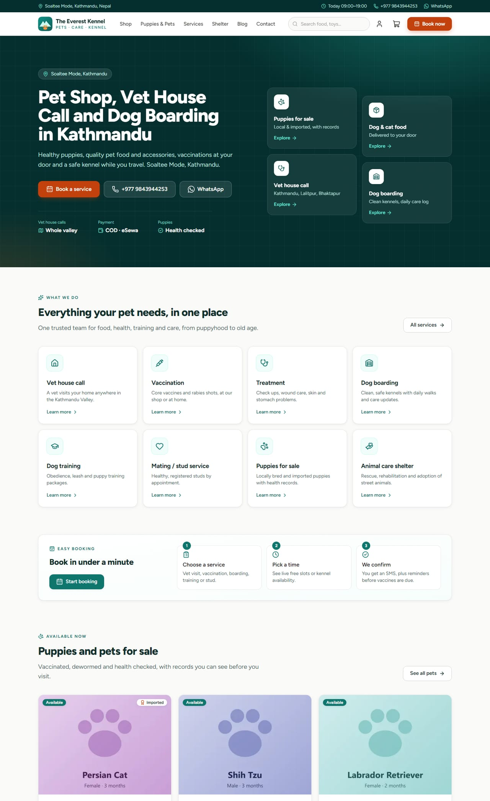
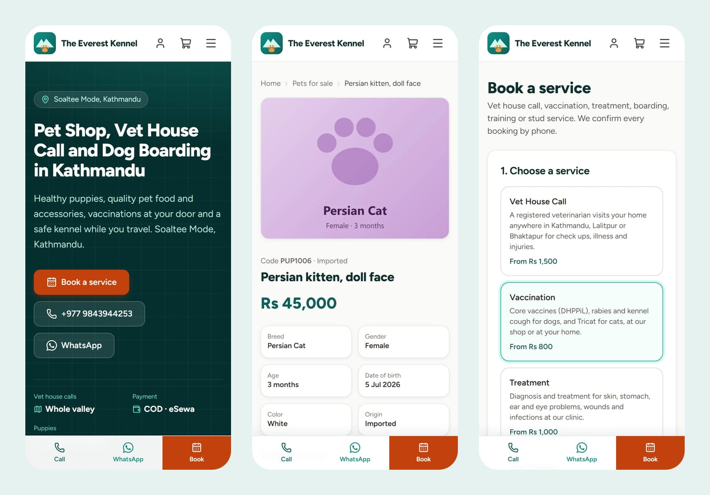
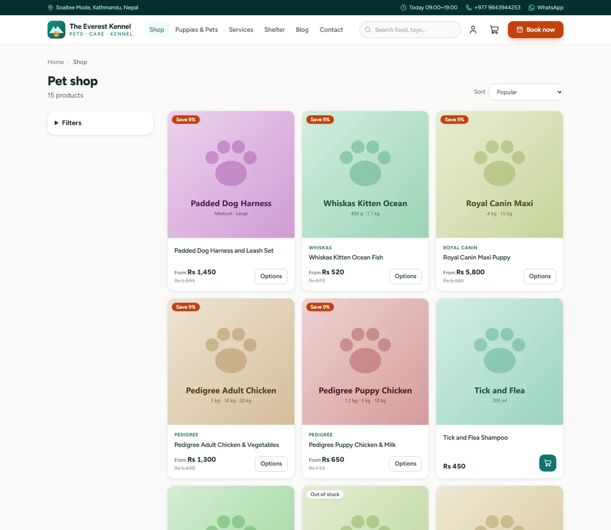
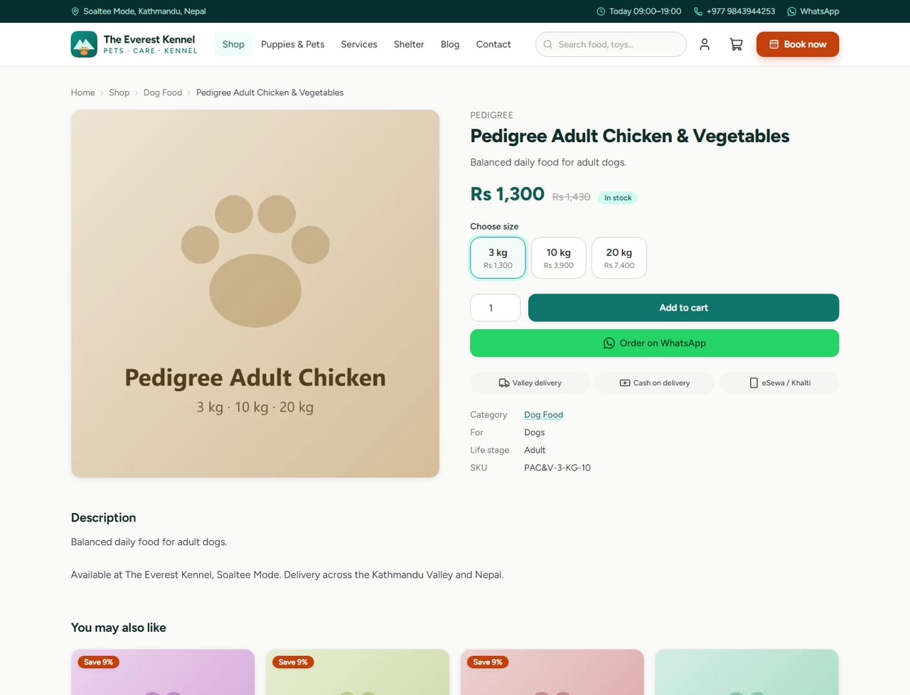
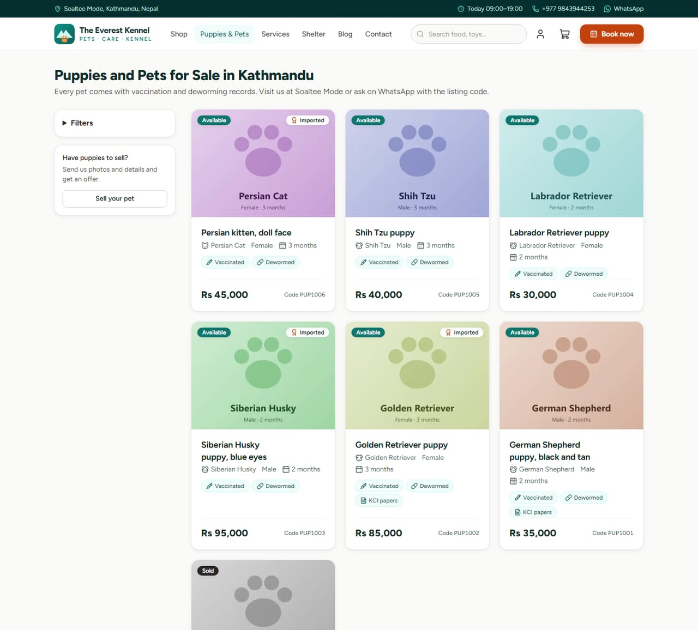
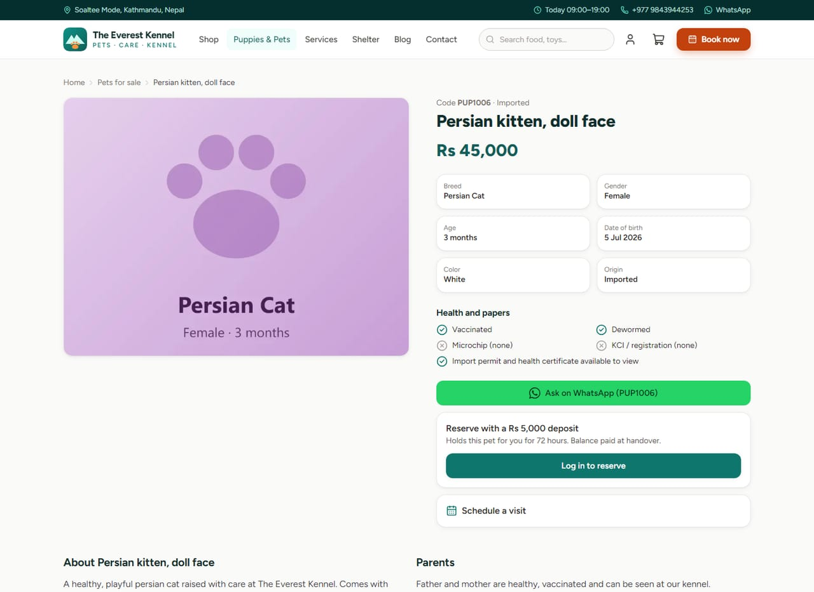
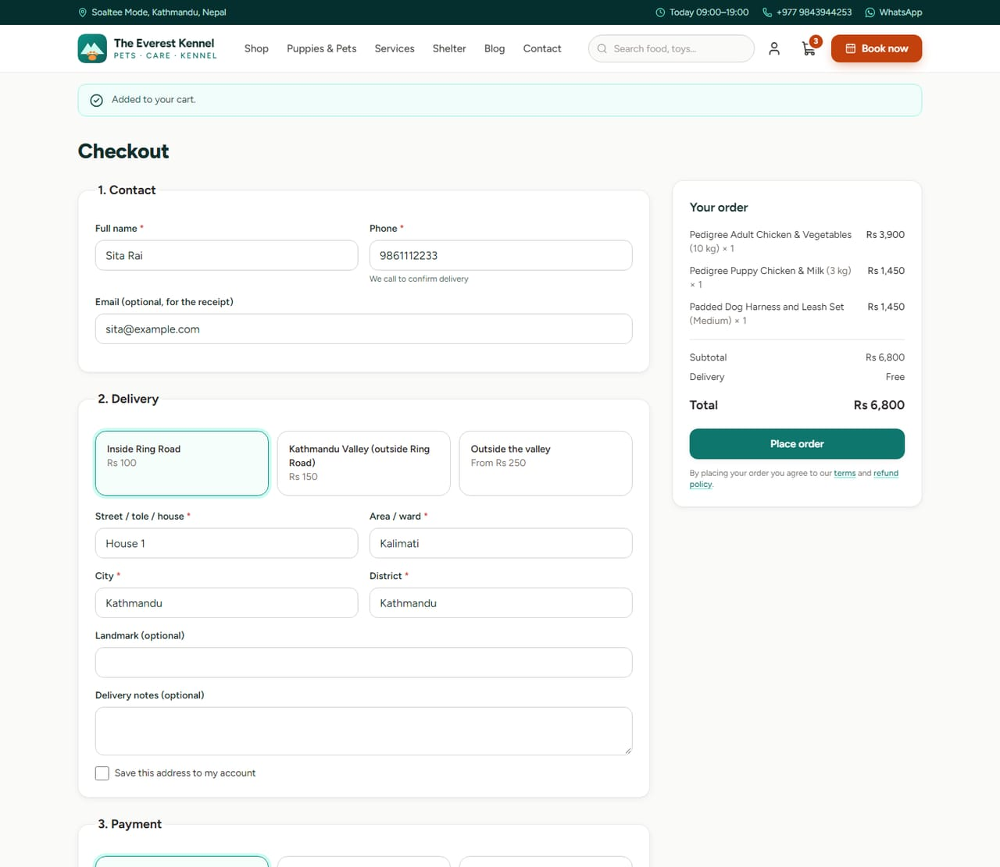
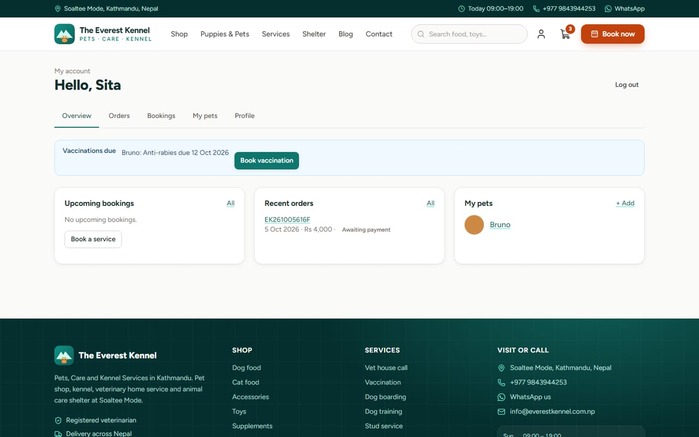
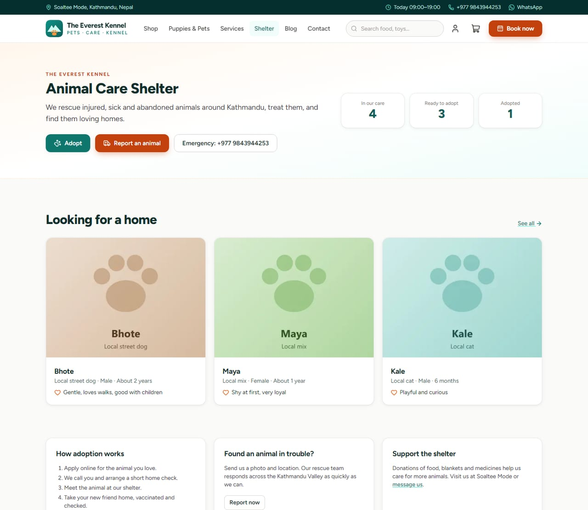
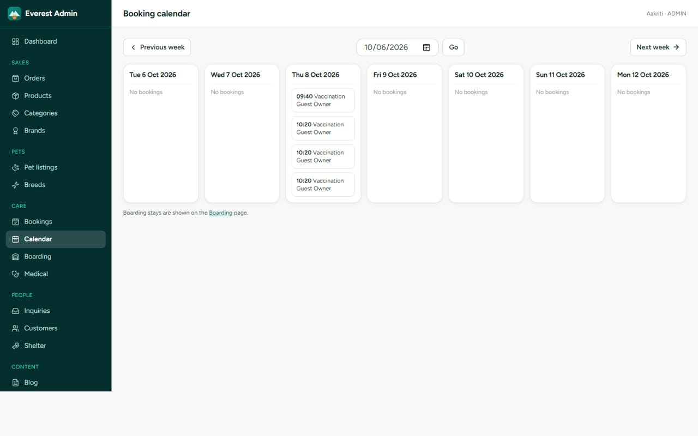

# The Everest Kennel

**Website, online shop, booking system and admin panel for a pet business in Kathmandu**

| | |
|---|---|
| **Client** | The Everest Kennel: pet shop, kennel, vet home service and animal shelter, Soaltee Mode, Kathmandu |
| **Type** | E-commerce + service booking + business management |
| **Year** | 2026 |
| **Status** | Complete and ready to launch |
| **Platform** | Web (desktop and mobile) |

## The client's problem

The Everest Kennel runs five businesses under one roof: a pet shop, puppy sales, a dog kennel, vet house calls and an animal shelter. Orders came in by phone and WhatsApp, bookings lived in a notebook, and nobody had a full picture of stock, boarding space or which pets were due for vaccines.

## What we built

One system that runs the whole business, with a public website for customers and an admin panel for staff.

### Home page
Call, WhatsApp and Book buttons sit at the top. Below them are the eight services, featured puppies, best sellers, reviews and the shelter.

### Built for phones first
Most customers browse on a phone. A sticky **Call · WhatsApp · Book** bar stays one tap away on every page.

### Online shop: food, accessories and toys
Customers filter by category, pet, life stage, brand and price, and pay by **cash on delivery, eSewa or Khalti**. Delivery fees are worked out for inside Ring Road, the rest of the valley, and outside the valley.

| Shop | Product page |
|---|---|
|  |  |

### Puppies and pets for sale
Every listing shows age, vaccinations, deworming, microchip and KCI papers. A buyer can ask on WhatsApp with the listing code, book a visit, or reserve the puppy with an online deposit.

| Pets for sale | Pet details |
|---|---|
|  |  |

### Service booking and checkout
Customers book a vet house call, vaccination, treatment, boarding, training or stud service from the free time slots. Guests confirm their phone number by SMS code, and checkout works with or without an account.

| Book a service | Checkout |
|---|---|
|  |  |

### Customer account and animal shelter
Customers keep each pet's vaccination history and get an **SMS reminder before every dose**. The shelter page lists animals for adoption and takes reports of injured street animals, with a photo and GPS location.

| My account | Shelter |
|---|---|
|  |  |

### Admin panel for the shop team
Orders, stock, bookings, boarding, medical records, the shelter and reports are all managed in one place.

| Dashboard | Booking calendar |
|---|---|
|  |  |

| Boarding occupancy | Order management |
|---|---|
|  |  |

## Key features

**For customers**
- Online shop with search, filters, product variants and "notify me when back in stock"
- Puppy listings with health records, videos and online reservation deposits
- A booking flow for vet visits, boarding, grooming, training and stud services
- Pet profiles with weight log, vaccination and medical history
- Order tracking, printable invoices, and booking reschedule or cancel
- Shelter adoption applications and injured-animal reports

**For the business**
- Dashboard: today's bookings, pending orders, low stock, boarding occupancy and a revenue chart
- Product and stock management with CSV import and export
- Week calendar for bookings and vet assignment, including phone and walk-in bookings
- 14-night boarding grid with check-in/out and a daily care log with photos
- Vaccination and treatment records with automatic SMS reminders
- Sales, top product and service revenue reports
- Staff roles (Staff, Vet, Admin) and an audit log of every change

**Runs on its own**
- Vaccination reminders go out 7 days and 1 day before each due date
- Unpaid online orders are cancelled after 30 minutes
- Pet reservations are released after 72 hours
- The sitemap refreshes every hour for Google

## Technology

| Area | Used |
|---|---|
| Backend | Node.js, Express 5, TypeScript |
| Database | MySQL / MariaDB with Prisma |
| Frontend | Server-rendered pages, Tailwind CSS, mobile first |
| Payments | eSewa ePay v2, Khalti, cash on delivery |
| Messaging | SMS (OTP and reminders), email, WhatsApp links |
| Security | Argon2id passwords, role-based access, rate limits, audit log |
| SEO | Structured data, sitemap, Open Graph images |

## Results for the client

- Customers can order, book and pay online at any hour, so staff no longer have to take every request by phone
- Staff see the whole business on one screen
- Automatic reminders bring customers back for vaccines
- Boarding space and vet time can no longer be double-booked

---

*Products, pets and posts in the screenshots are demo data.*

**Built by Pradip Subedi · Sprasa Technical Solution**
Want something similar for your business? [Get in touch](../README.md#contact).
