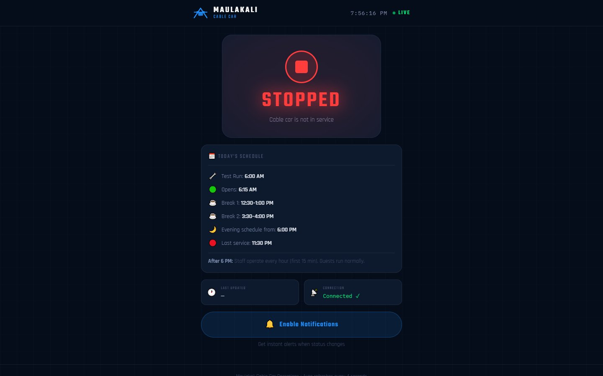
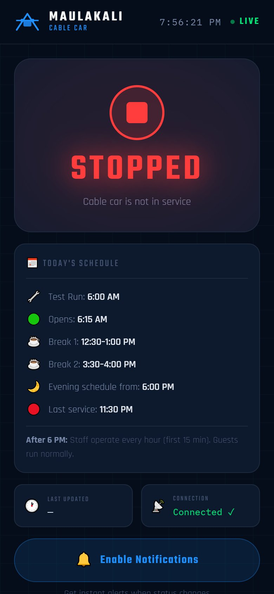

# Maulakali Cable Car Live Status

**A live status page and phone app that tells passengers whether the cable car is running**

| | |
|---|---|
| **Client** | Maulakali Cable Car, Gaindakot |
| **Type** | Progressive web app (PWA) with push notifications |
| **Year** | 2026 |
| **Status** | Complete (version 2) |
| **Platform** | Web, installable on Android and iPhone |

## The client's problem

Visitors travelled to the station without knowing whether the cable car was running, on a break, or stopped for weather or maintenance. Staff answered the same question on the phone all day.

## What we built

A simple status page that anyone can open or install on their phone. It shows the live status, today's timetable and a countdown to the next service, and sends a push notification when the status changes.

| Live status (desktop) | On a phone |
|---|---|
|  |  |

## Key features

- **Live status:** Running, Break, Stopped, Test Run and more, with a live clock
- **Auto schedule engine:** status follows the operating timetable (test run 06:00, opening 06:15, two daily breaks, evening schedule, last service)
- **Operator panel:** change any timing from the dashboard without touching code
- **Manual override:** force a status (for weather or maintenance) and pause the automatic schedule
- **Push notifications:** passengers who opt in get an alert when the status changes; operators can also send custom messages
- **Status history:** a full log of every change and who made it
- **Next event countdown** for passengers
- **Installable and offline-ready:** works like an app and shows a friendly offline page

## Technology

| Area | Used |
|---|---|
| Backend | PHP, MySQL |
| App | Progressive web app: manifest, service worker, offline page |
| Notifications | Web Push with VAPID keys |
| Automation | Cron job keeps the schedule engine running |

---

**Built by Pradip Subedi · Sprasa Technical Solution**
Want something similar for your business? [Get in touch](../README.md#contact).
