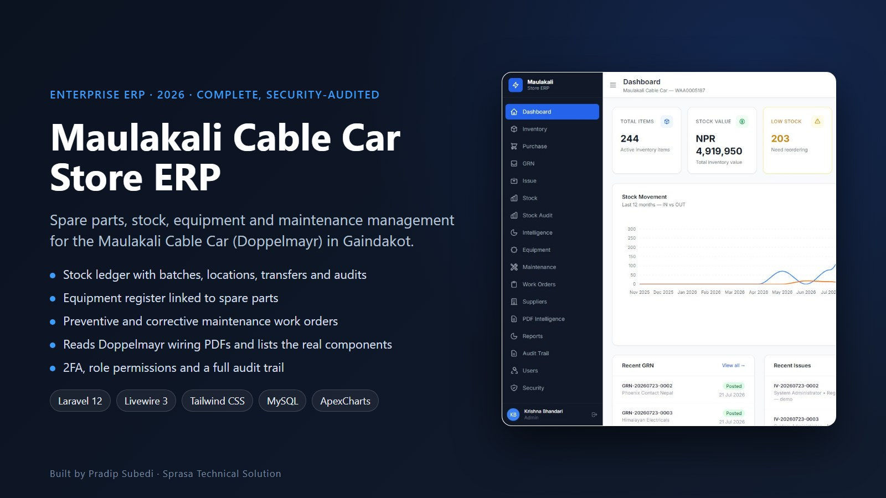
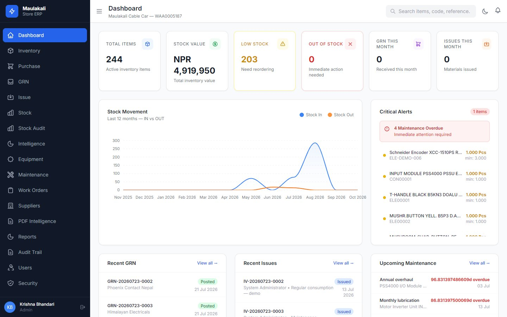
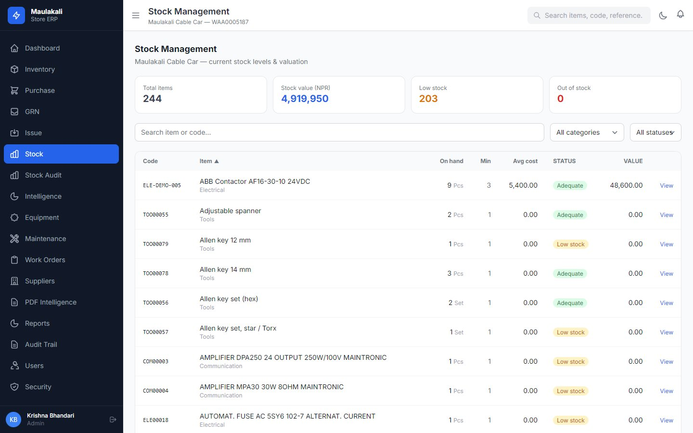
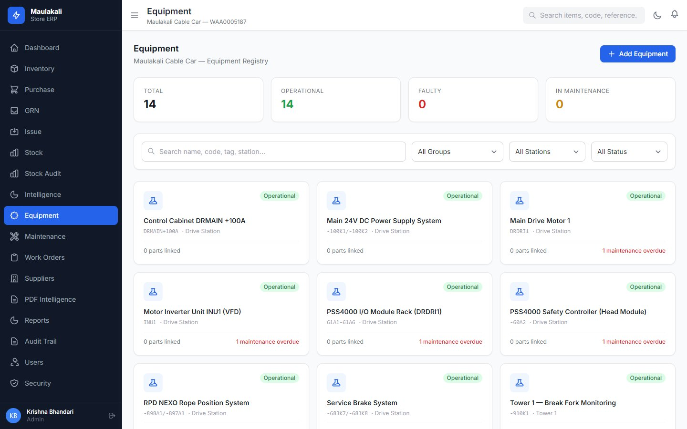
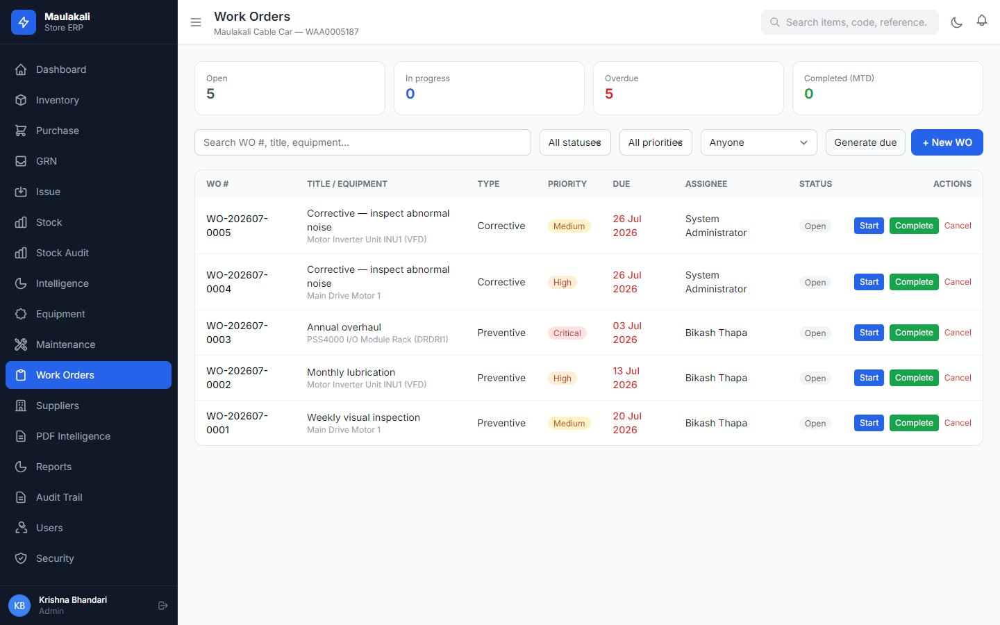
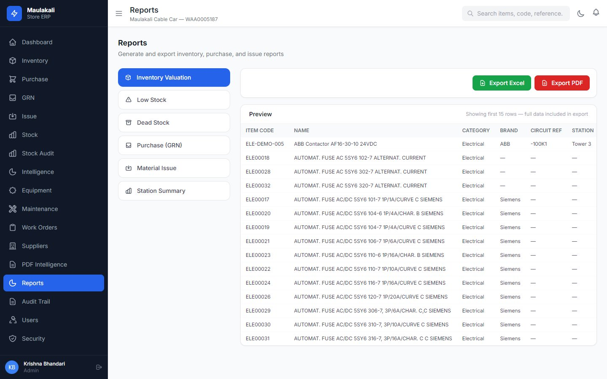
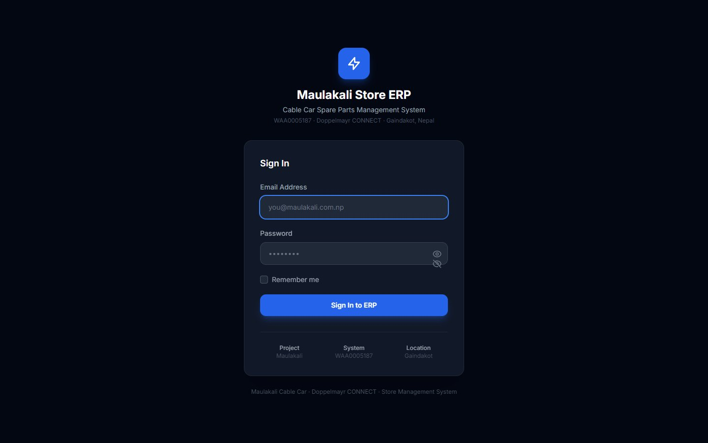

# Maulakali Cable Car Store ERP

**Spare parts, stock, equipment and maintenance system for a working cable car**

| | |
|---|---|
| **Client** | Maulakali Cable Car, Gaindakot, Nawalpur (Doppelmayr CONNECT, WAA0005187) |
| **Type** | Enterprise store and maintenance management (ERP) |
| **Year** | 2026 |
| **Status** | Complete; security audit completed and all critical and high findings closed |
| **Platform** | Web (desktop, tablet, phone) |

## The client's problem

A cable car can't wait for parts. The maintenance team kept spare parts, relays, fuses and drive components in a store tracked on paper and spreadsheets. Nobody could say quickly what was in stock, where it was, what it cost, or which machine it belonged to. Maintenance schedules lived in people's heads.

## What we built

A store and maintenance ERP built around how the cable car team actually works: receive parts, store them by location, issue them to a job, and keep every machine's maintenance on schedule.

### Dashboard
Stock value, low and out-of-stock items, goods received, items issued, a 12-month stock movement chart, critical alerts and upcoming maintenance.

### Stock and equipment

| Stock management | Equipment register |
|---|---|
|  |  |

### Maintenance and reports

| Work orders | Reports with Excel and PDF export |
|---|---|
|  |  |

### Sign in

## Key features

- **Inventory:** items with photos, documents, batches, units, brands, categories and storage positions
- **Stock ledger:** every movement is recorded; stock can only change through the ledger, never by editing a number
- **Purchasing:** purchase orders, goods received notes (GRN) with supplier invoices, and suppliers
- **Issues and transfers:** issue vouchers to jobs, transfers between locations, per-location balances
- **Stock audits:** count, compare against live stock, and post the difference
- **Equipment:** register of cable car equipment by group and station, linked to its spare parts
- **Maintenance:** schedules, logs, and preventive or corrective work orders with priority and due dates
- **PDF intelligence:** upload the Doppelmayr wiring diagram and the system finds 30+ real components (PSS4000, relays, fuses, VFD, terminal blocks) with their references
- **Reports:** inventory valuation, low stock, dead stock, purchases, material issues, station summary; export to Excel and PDF
- **Security:** two-factor login (TOTP), forced password change, login lockout, role editor with detailed permissions, private file storage, audit log

## Technology

| Area | Used |
|---|---|
| Backend | Laravel 12 (PHP 8.3), repository and service layers |
| Frontend | Livewire 3, Blade, Tailwind CSS, Alpine.js, ApexCharts |
| Database | MySQL 8 |
| Jobs | Scheduler for alerts and maintenance reminders, queued PDF extraction |

## Results for the client

- The store team knows exactly what is on the shelf, where, and what it is worth
- Low stock and overdue maintenance are flagged before they become downtime
- Every part issued is traceable to a job and a person

---

**Built by Pradip Subedi · Sprasa Technical Solution**
Want something similar for your business? [Get in touch](../README.md#contact).
