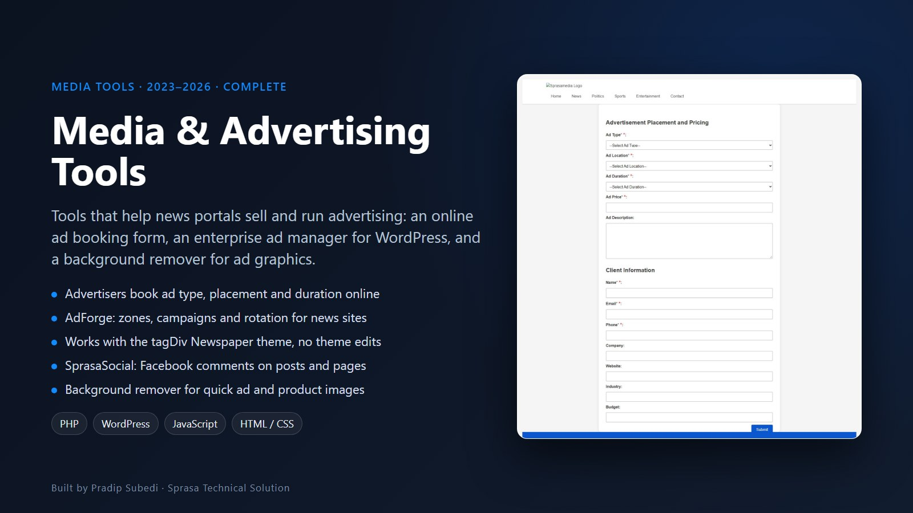
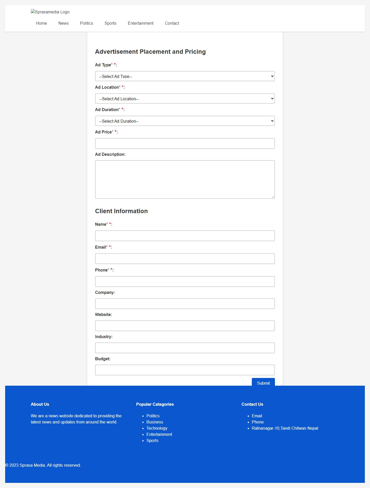

# Media & Advertising Tools

**Tools that help news portals sell, place and manage advertising**

| | |
|---|---|
| **Client** | Sprasa Media and other Nepali news portals |
| **Type** | Advertising tools and WordPress plugins |
| **Years** | 2023–2026 |
| **Status** | Complete |
| **Platform** | Web, WordPress |

## The problem

Advertising pays for most Nepali news portals, but selling ads usually happens by phone and Messenger, and ad code is pasted straight into theme files. When the theme updates, the ads break, and nobody can say which ad ran where or for how long.

## What we built

### Online ad booking form
Advertisers choose the ad type (header, sidebar, banner or sponsored content), the location on the page, the duration (1 month to 1 year) and the price, then fill in their company details. The request goes straight to the portal's team with a thank-you confirmation for the advertiser.

### AdForge: enterprise advertisement manager (WordPress)
Ad management for busy news sites, built to work with the popular tagDiv Newspaper theme.
- Every ad, zone, campaign and rotation managed from one dashboard
- No theme files edited, so theme updates never break the ads
- Built for high-traffic portals

### SprasaSocial (WordPress)
Adds a Facebook comments box to posts and pages.
- Set the Facebook App ID and choose where the box appears
- Shortcode for custom placement and a per-post switch to turn it off

### Background remover
A simple browser tool that removes the background from an uploaded image, for quick ad creatives and product photos.

## Related work

- [Sprasa Media News CMS](../sprasa-media-cms/): a full ad engine with targeting, A/B rotation and click tracking
- [Sprasa WordPress Themes & Plugins](../wordpress-themes-plugins/): SprasaAds, SprasaAds Pro and Sprasa SEO
- [Nepali News Websites](../nepali-news-websites/): the portals these tools were built for

---

**Built by Pradip Subedi · Sprasa Technical Solution**
Running a news portal? [Get in touch](../README.md#contact).
