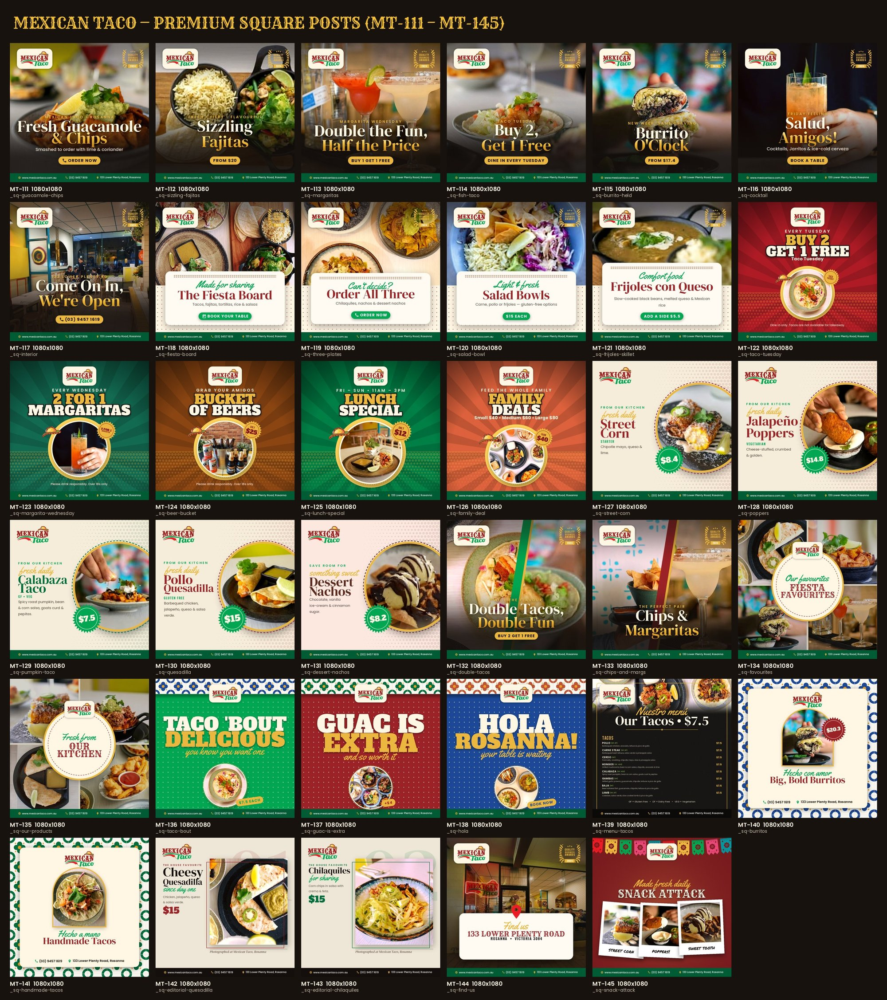
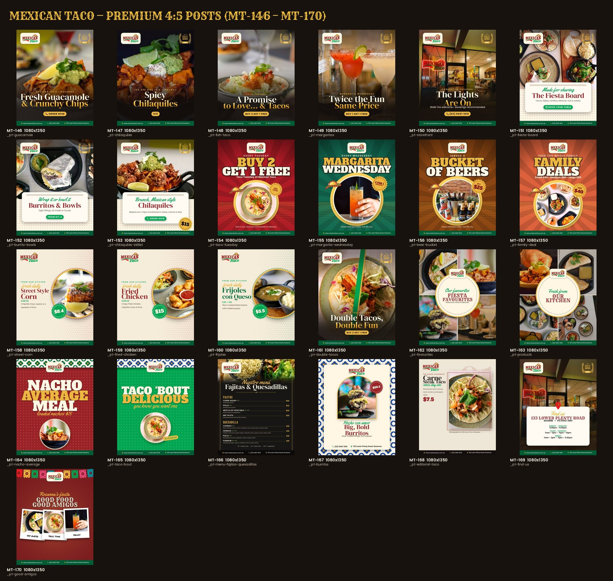
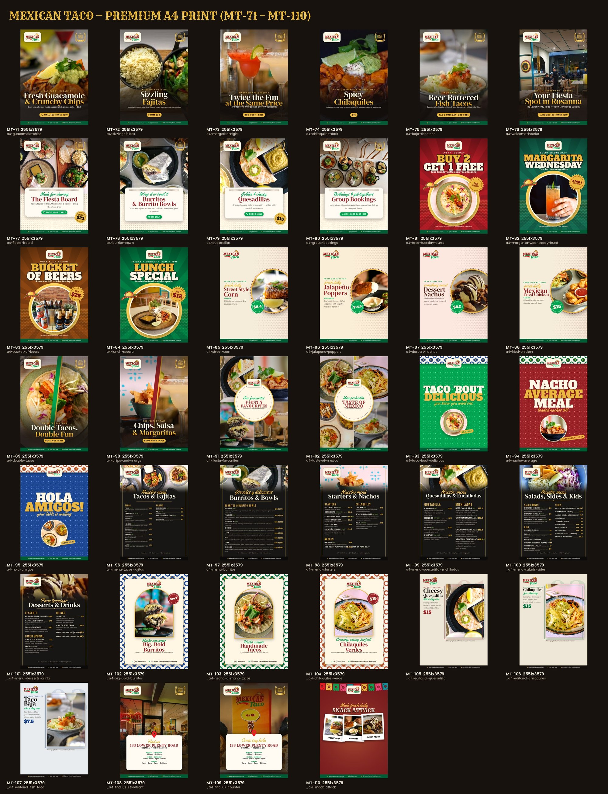
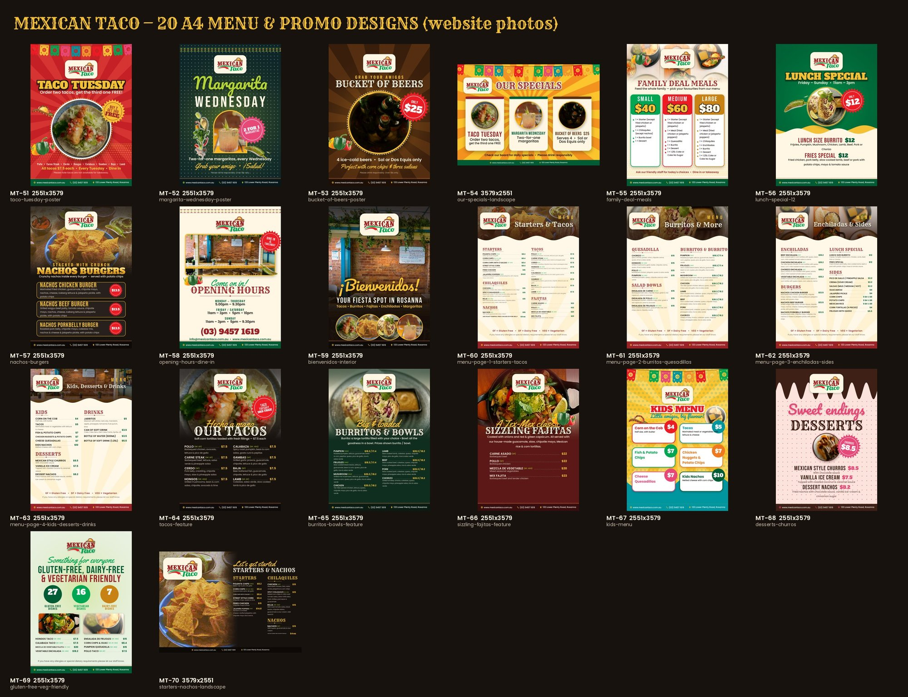
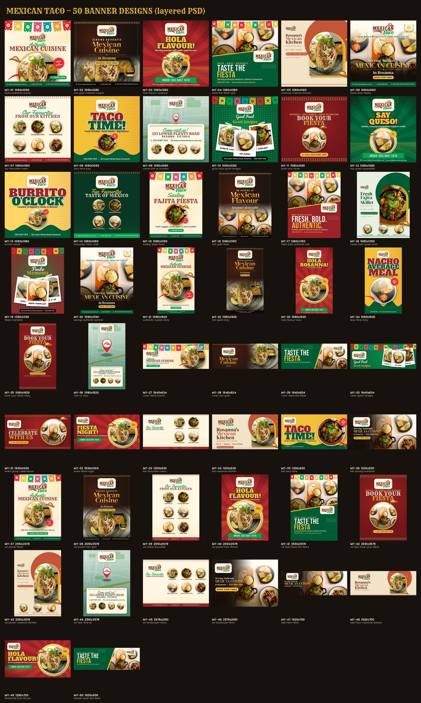

# Mexican Taco Design Kit

**170 editable banner, social media and print designs for a restaurant**

| | |
|---|---|
| **Client** | Mexican Taco, Rosanna, Australia ([mexicantaco.com.au](https://www.mexicantaco.com.au/)) |
| **Type** | Graphic design, branding and print |
| **Year** | 2026 |
| **Status** | Complete |
| **Format** | Layered Photoshop (.psd) files + JPG previews |

## The client's problem

The restaurant posts specials and menus every week but had no consistent design system, and each new post started from scratch. They wanted a large set of on-brand templates the staff could edit themselves: change a price, swap a photo, post.

## What we delivered

**170 layered Photoshop designs.** Every headline, price, menu item and contact line is a real text layer. Outlines, shadows and the gold gradients are live effects, so nothing has to be redrawn.

### Premium set: the restaurant's own photography (MT-71 to MT-170)
Moody food photos, logo top-left, the Quality Business Awards seal and the green contact bar, matching the restaurant's existing social style.

**Social posts, 1080×1080**

**Instagram / Facebook portrait, 1080×1350**

**A4 print, 300 DPI with 3 mm bleed**

### A4 menu and promo set (MT-51 to MT-70)
Taco Tuesday, Margarita Wednesday, family deals, specials and the full four-page menu, built from the real menu.

### First set (MT-01 to MT-50)
Posts, stories, covers, ads and website banners.

## What's included

| Set | Format | Designs |
|---|---|---|
| MT-01 – MT-50 | Social posts, stories, covers, ads, web banners | 50 |
| MT-51 – MT-70 | A4 menu and promo posters | 20 |
| MT-71 – MT-110 | Premium A4 print, 300 DPI | 40 |
| MT-111 – MT-145 | Premium square posts 1080×1080 | 35 |
| MT-146 – MT-170 | Premium portrait posts 1080×1350 | 25 |

- Twelve premium layouts: Hero Dark, Card, Offer Burst, Spotlight, Duo, Mosaic, Type Poster, Menu Board, Talavera Frame, Editorial, Location and Polaroids
- Photo layers named "replace me", so staff can drop in a new photo and keep the shape
- Prices named by value, so all of them can be found in seconds
- Free commercial fonts included, with a one-page "how to edit" guide

---

**Designed by Pradip Subedi · Sprasa Technical Solution**
Need a design kit for your brand? [Get in touch](../README.md#contact).
