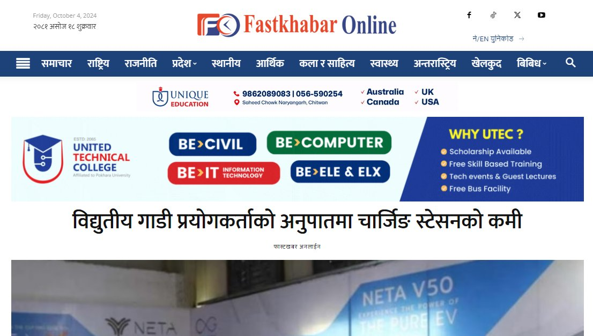
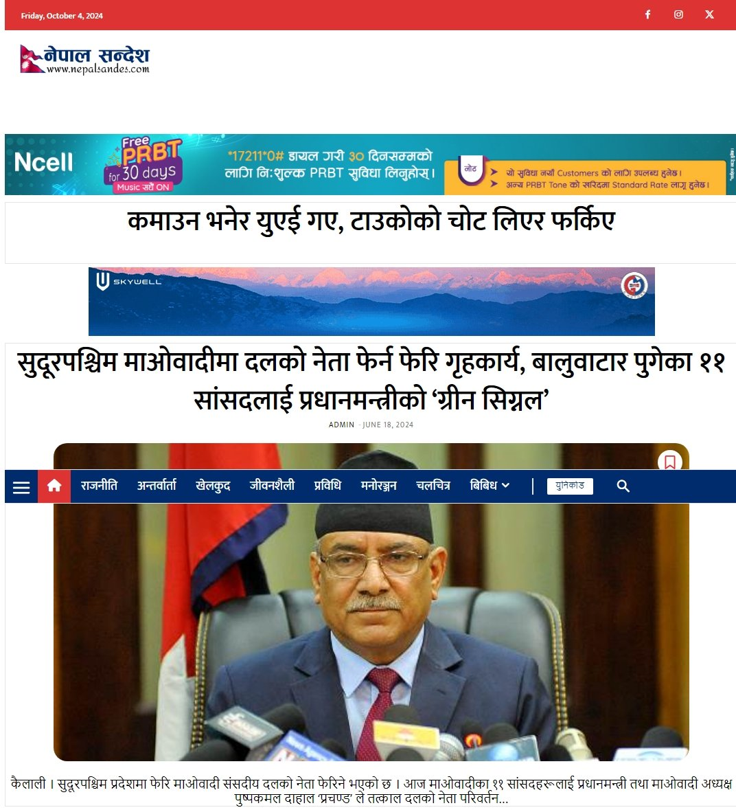

# Nepali News Websites

**WordPress news portals built for Nepali publishers**

| | |
|---|---|
| **Clients** | Fastkhabar Online, Nepal Sandes |
| **Type** | News portal websites |
| **Year** | 2024 |
| **Status** | Delivered |
| **Platform** | WordPress |

## Fastkhabar Online

[fastkhabaronline.com](https://fastkhabaronline.com)

A Nepali news website with a home page of the latest and trending stories, a stock market section, and sections for every major news category.

| | |
|---|---|
| **Completion time** | 35 days |
| **Built with** | WordPress, a custom-built theme, custom plugins and deep theme changes |

- Dynamic home page with latest and trending news
- Stock market section with market updates
- Custom theme built for speed and flexibility
- Custom plugins for features the publisher needed
- Responsive on every device and tuned for search

The same publisher's brand colours and Nepali category structure were later reused when we built our own [Sprasa Media News CMS](../sprasa-media-cms/) platform.

## Nepal Sandes

[nepalsandes.com](https://nepalsandes.com)

A Nepali news website with a home page of featured articles, a Unicode tool, and a stock market section.

| | |
|---|---|
| **Completion time** | 25 days |
| **Built with** | WordPress, Newspaper theme, TagDiv Composer, custom code |

- Dynamic home page with latest and featured articles
- Full Nepali Unicode publishing
- Stock market section
- Responsive and SEO-optimised

## What we do for news publishers

- Domain, hosting and launch
- Theme setup or a fully custom theme
- Categories, menus, ad placements and social sharing
- Speed, security and backups
- Training for editors and reporters

---

**Built by Pradip Subedi · Sprasa Technical Solution**
Starting a news portal? [Get in touch](../README.md#contact).
