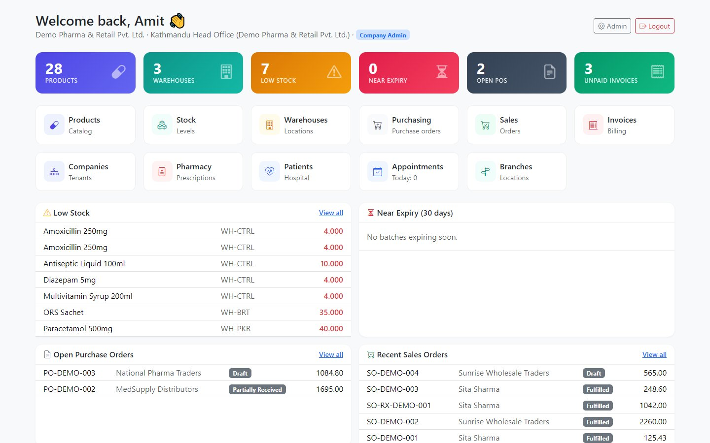
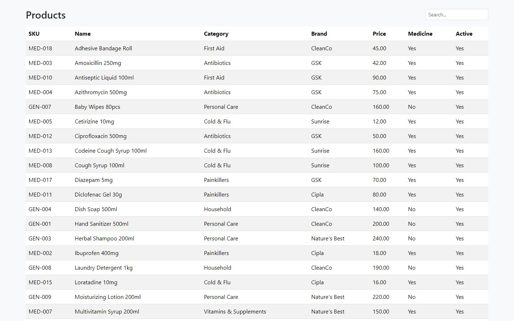
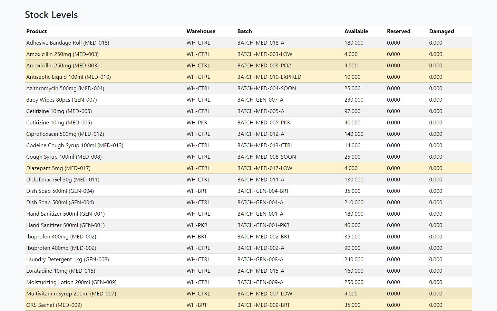
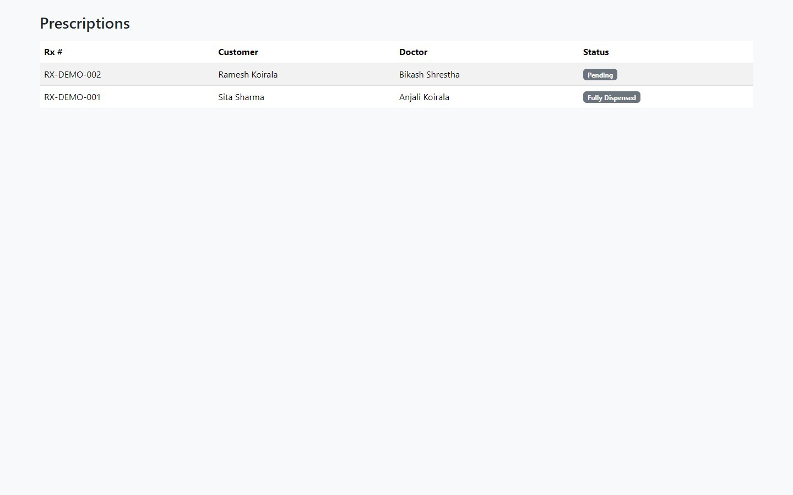
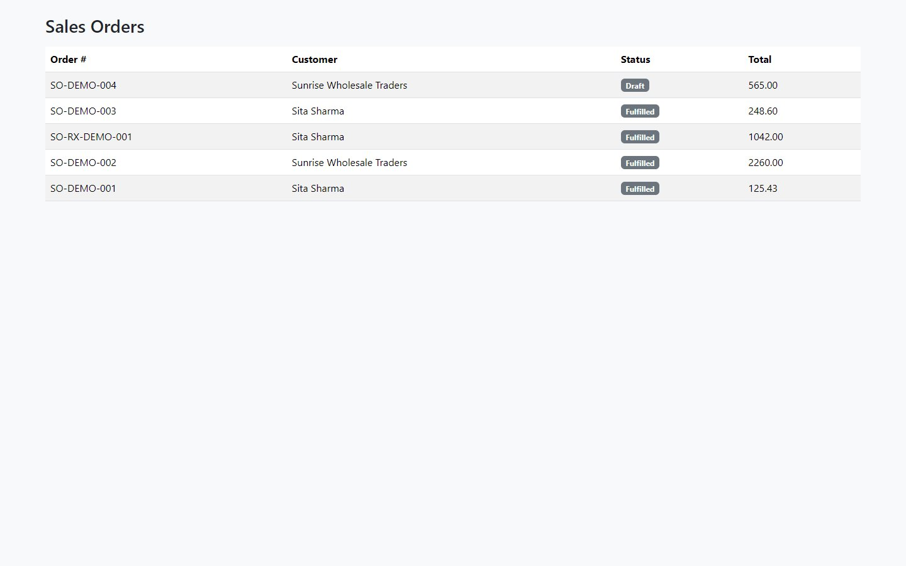
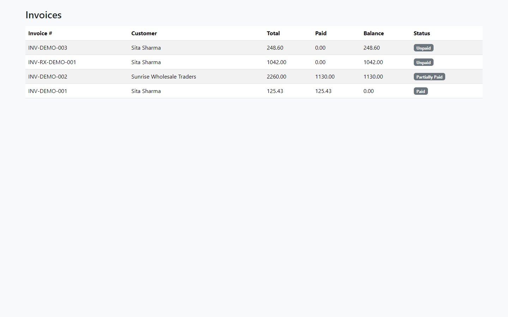
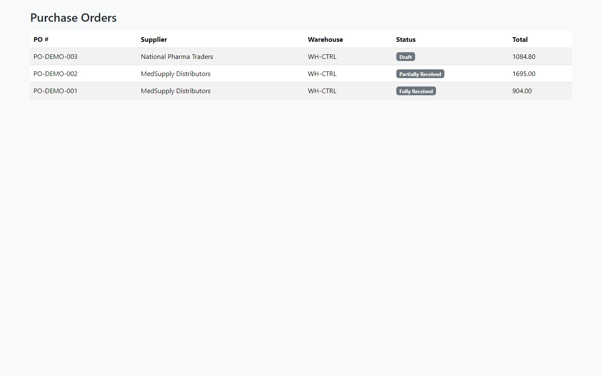
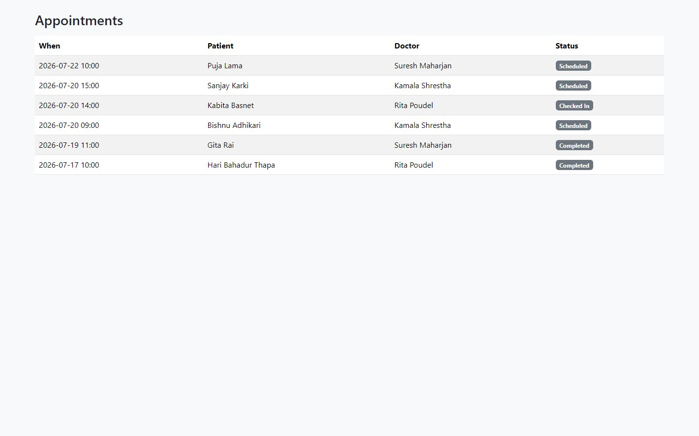
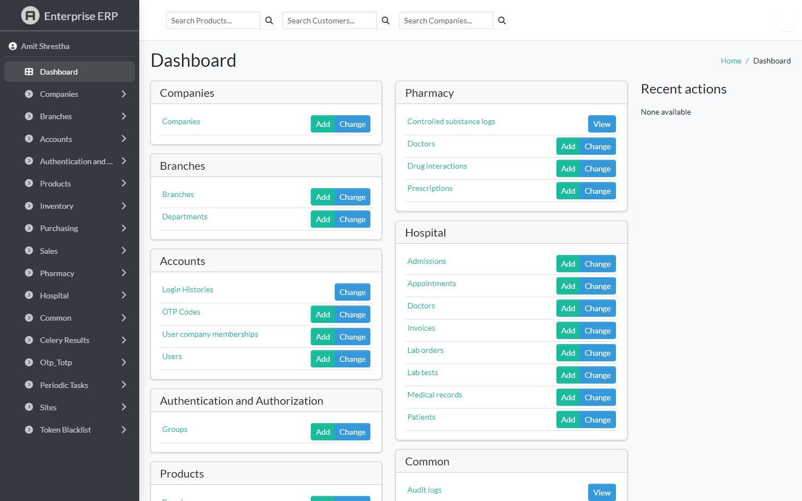

# Pharmacy & Hospital ERP

**Inventory, purchasing, sales, pharmacy and hospital management in one system**

| | |
|---|---|
| **Client** | Pharmacies, clinics, hospitals and multi-branch retailers |
| **Type** | Enterprise ERP / CRM |
| **Year** | 2026 |
| **Status** | Phases 1–5 complete (98 automated tests passing) |
| **Platform** | Web app + REST API |

## The problem

Pharmacies and small hospitals often run three or four separate tools: one for stock, one for billing, paper prescriptions and a notebook for patients. Expiring stock gets missed, controlled medicines are hard to report, and the owner can't see all branches at once.

## What we built

One ERP that handles the whole chain: buy stock, store it by batch and expiry, sell it or dispense it against a prescription, bill the patient, and report on everything, across several companies and branches.

### Dashboard
Products, warehouses, low stock, items near expiry, open purchase orders and unpaid invoices, with quick links to every module.

### Products and stock

| Product catalogue | Stock by warehouse and batch |
|---|---|
|  |  |

### Pharmacy, sales and purchasing

| Prescriptions | Sales orders |
|---|---|
|  |  |

| Invoices | Purchase orders |
|---|---|
|  |  |

### Hospital and administration

| Appointments | Admin console |
|---|---|
|  |  |

## Key features

**Inventory and products**
- Products with medicine, prescription-only and controlled-substance flags
- Several warehouses, batches and expiry dates; sells the batch that expires first (FEFO)
- Stock transfers between warehouses with approval, damage write-offs and count corrections

**Purchasing and sales**
- Purchase orders from draft to approved to partly or fully received
- Sales orders, walk-in counter sales, invoices with paid/partial/unpaid tracking and overpayment protection

**Pharmacy**
- Prescriptions that track how much of each medicine is still to be dispensed
- Drug interaction warnings when medicines are dispensed together
- A separate, locked log for controlled substances, ready for regulator reports

**Hospital**
- Doctors, patients (with allergies and chronic conditions), OPD appointments with a strict status flow
- Inpatient admissions, ward and bed, discharge
- Medical records, lab test orders and results
- Hospital billing for consultation, lab and bed charges

**Platform**
- 17 business roles (branch admin, pharmacist, cashier, doctor, receptionist, accountant, auditor and more)
- Multi-company data separation, so one company never sees another's records
- Login by email, username or phone, OTP, account lockout and login history
- REST API with JWT and interactive API documentation
- Demo data for every module

## Technology

| Area | Used |
|---|---|
| Backend | Python, Django, Django REST Framework |
| Database | PostgreSQL (SQLite for development) |
| Background jobs | Celery |
| Admin UI | Jazzmin admin theme + custom dashboard |
| Hosting | Docker / docker-compose |

---

*All names and figures in the screenshots are demo data.*

**Built by Pradip Subedi · Sprasa Technical Solution**
Want something similar for your business? [Get in touch](../README.md#contact).
