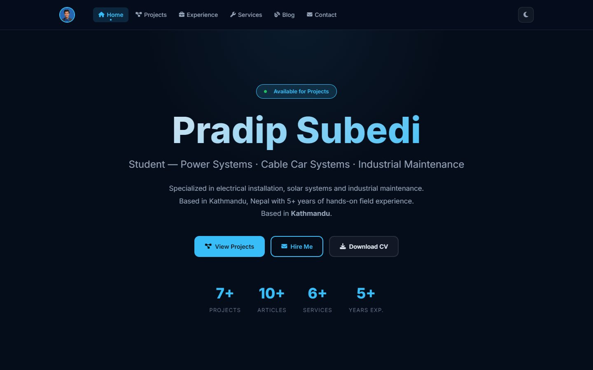
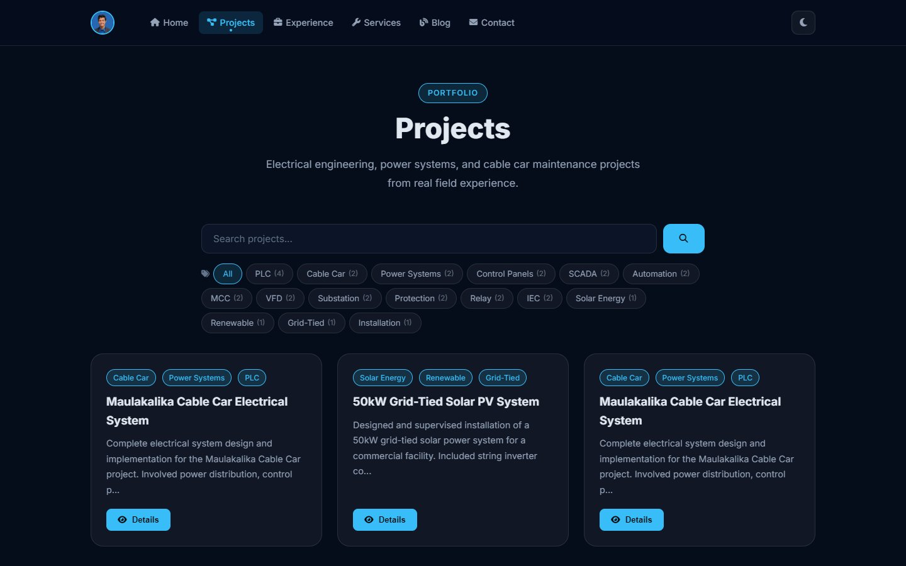
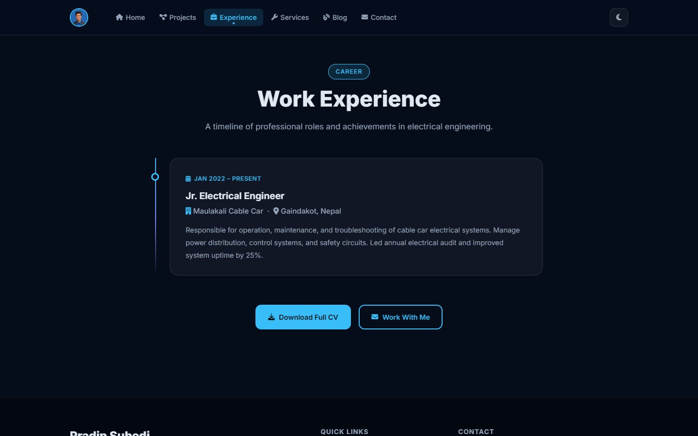
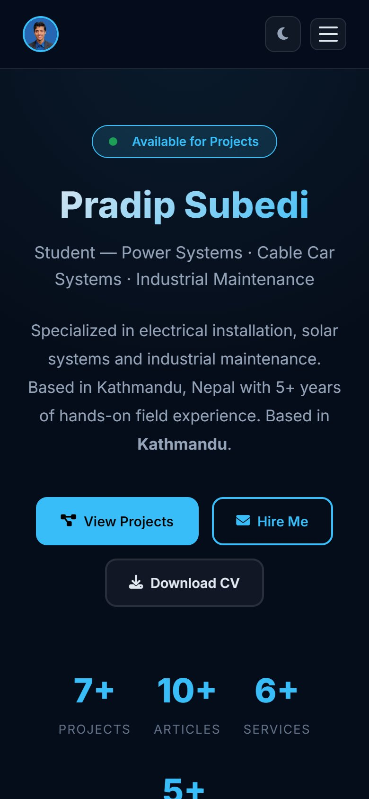

# Portfolio CMS Template

**A portfolio website with its own admin panel, ready to set up for any professional**

| | |
|---|---|
| **Client** | Students, engineers, freelancers and professionals |
| **Type** | Portfolio website + blog + admin CMS |
| **Year** | 2026 |
| **Status** | Reusable product; several personal sites built from it |
| **Platform** | Web, any PHP host |

## The idea

Most people who need a portfolio can't edit code. This template gives them a professional site and an admin panel where every word, image and section can be changed.

| Home | Projects |
|---|---|
|  |  |

| Experience timeline | On a phone |
|---|---|
|  |  |

## Key features

**Website**
- Home, projects, experience, services, blog and contact pages
- Animated hero with counters, project search and tag filters, pagination
- SEO-friendly blog URLs, custom 404 page, maintenance mode
- Dark and light themes, mobile menu, smooth scroll animations

**Admin panel**
- Profile and branding: name, title, bio, photo, CV upload, hero section
- Blog and projects with a rich text editor, images, tags, links and SEO fields
- AI writing help for blog posts
- Services, experience timeline and skills (add, edit, reorder)
- Contact messages inbox, with email notifications via PHPMailer

**Security and speed**
- CSRF protection, brute-force lockout and secure sessions
- GZIP, browser caching and clean URLs

## Technology

| Area | Used |
|---|---|
| Backend | PHP, MySQL |
| Editor | Quill.js |
| Email | PHPMailer |

---

**Built by Pradip Subedi · Sprasa Technical Solution**
Want your own portfolio site? [Get in touch](../README.md#contact).
