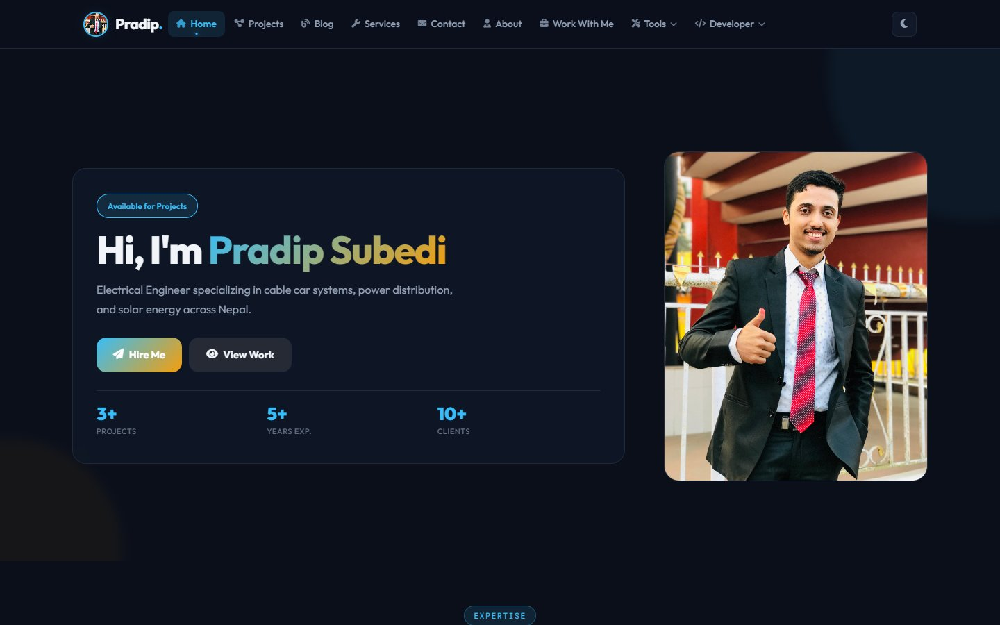
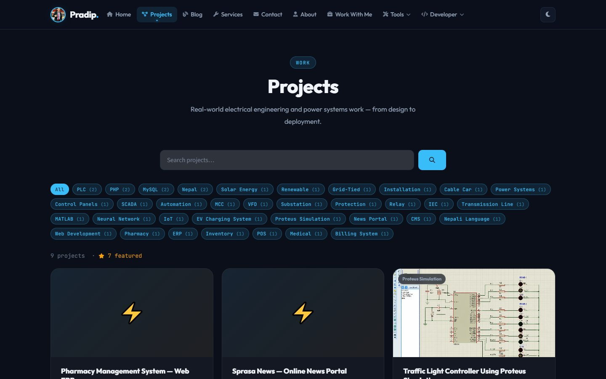
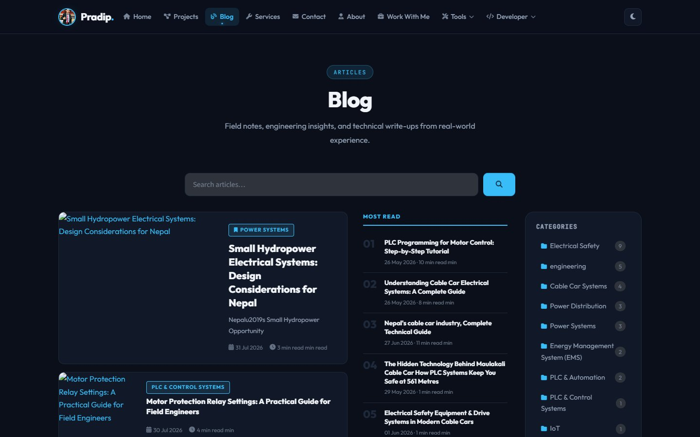
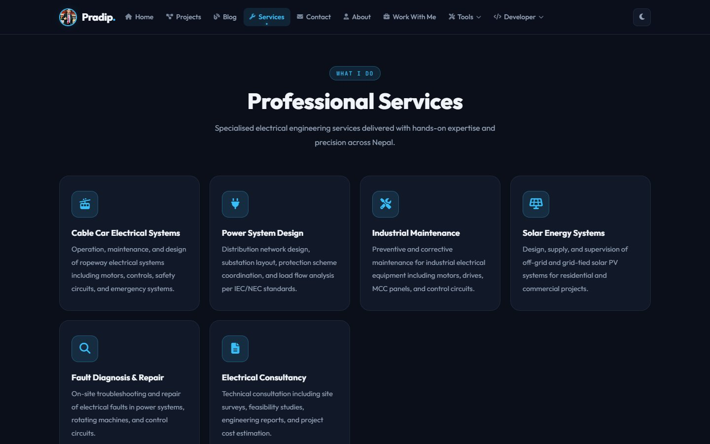
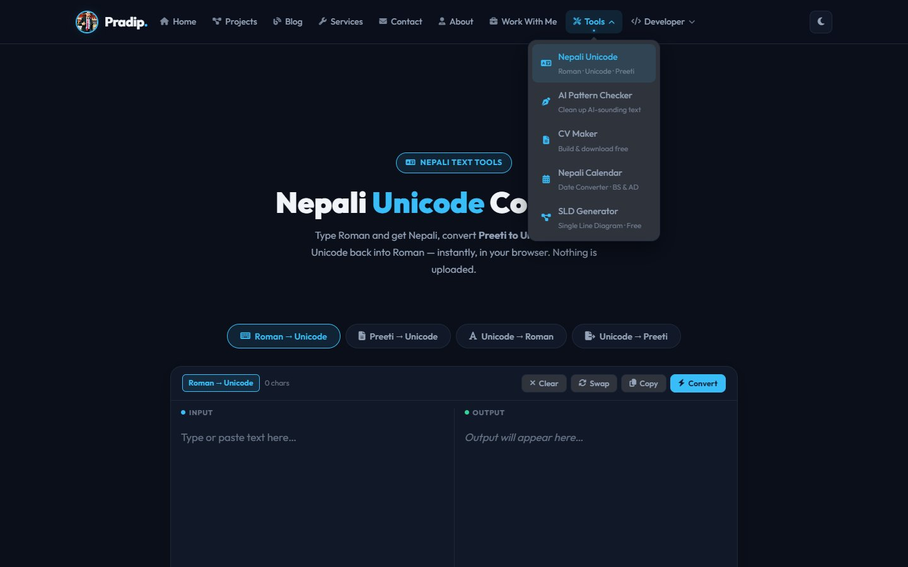
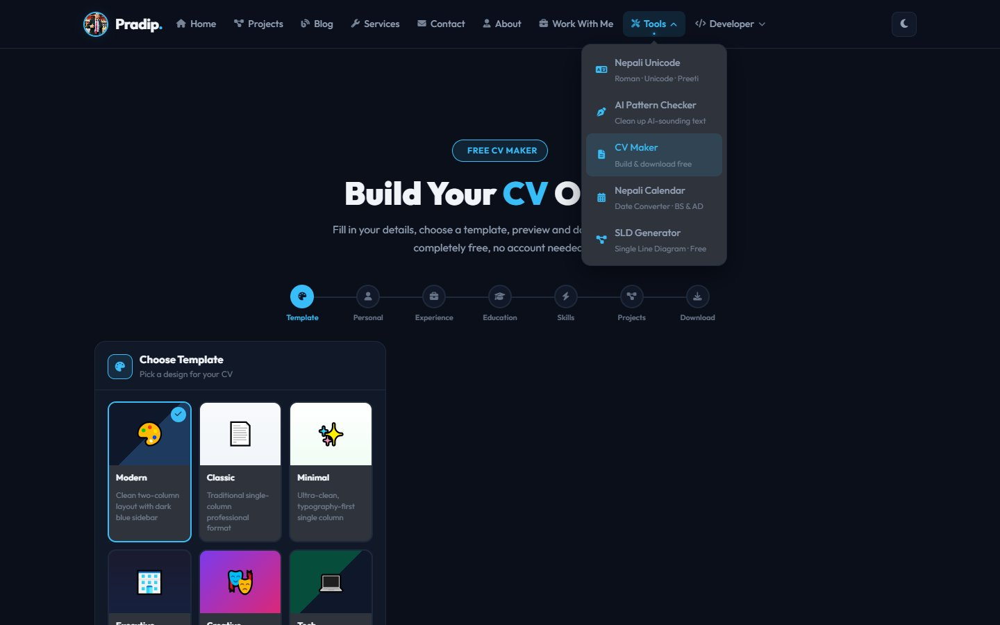
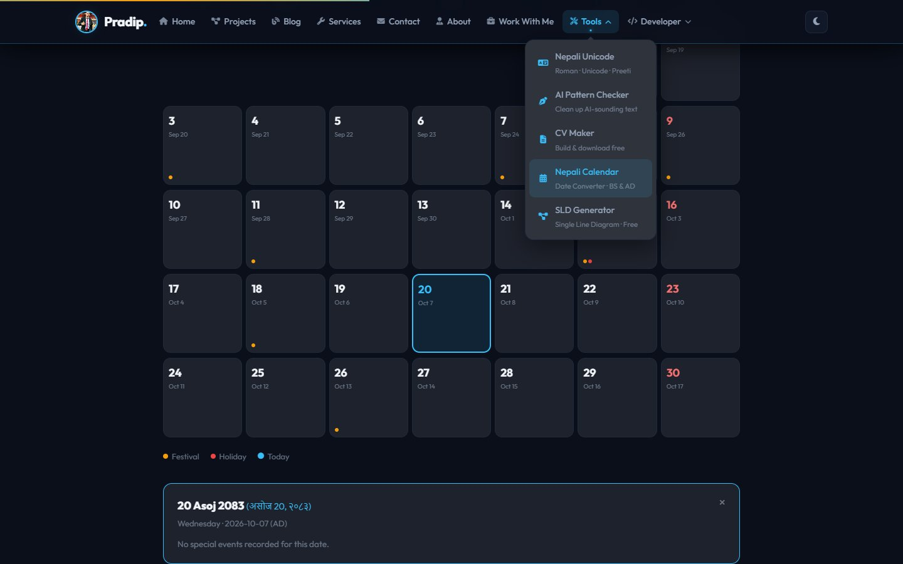
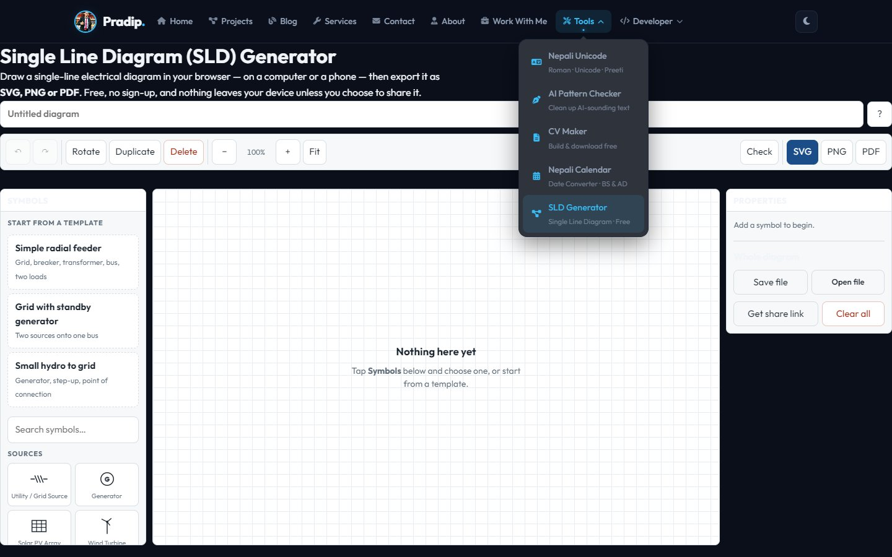
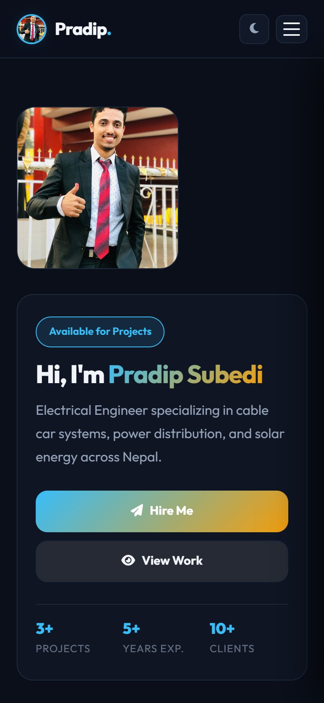

# pradipsubedi1.com.np

**Personal brand website for an electrical engineer, with free tools anyone can use**

| | |
|---|---|
| **Client** | Pradip Subedi (personal brand) |
| **Type** | Portfolio + blog + online tools + custom CMS |
| **Year** | 2026 |
| **Status** | Live at [pradipsubedi1.com.np](https://pradipsubedi1.com.np) |
| **Platform** | Web, installable (PWA) |

## The idea

A portfolio that does more than list projects. Engineers and students come back to it because it has tools they actually need: typing in Nepali, building a CV, checking the Nepali calendar, and drawing electrical single-line diagrams.

### Portfolio and blog

| Home | Projects |
|---|---|
|  |  |

| Engineering blog | Services |
|---|---|
|  |  |

### Free tools

| Nepali Unicode converter | CV maker |
|---|---|
|  |  |

| Nepali calendar (Patro) | Single-line diagram generator |
|---|---|
|  |  |

## Key features

**Public site**
- Portfolio with project filters by technology (PLC, SCADA, VFD, solar, cable car and more)
- Engineering blog on cable cars, hydropower, motor protection and PLCs, with comments
- Services, experience timeline, contact, and a "Work with me" page
- Search, sitemap, structured data and an installable offline app

**Free tools**
- **Nepali Unicode:** Romanized → Unicode, Preeti ⇄ Unicode, Unicode → Roman
- **CV maker:** choose a template, fill in your details, download a PDF
- **Nepali calendar:** Bikram Sambat dates, festivals and holidays
- **SLD generator:** draw single-line electrical diagrams in the browser from templates and symbols, then export SVG, PNG or PDF
- Developer pages: Unicode API and Nepali Patro widget for other sites

**Behind the scenes**
- Custom admin with a drag-and-drop page builder, 8 header styles, several footer and blog card styles
- Scheduled publishing, SEO manager, maintenance mode, chat and widgets
- Google sign-in and OTP for admins
- A full security audit was completed: prepared statements throughout, safe uploads and a hardened login

## Technology

| Area | Used |
|---|---|
| Backend | PHP, MySQL (39 tables) |
| Frontend | Custom CSS theme system with dark and light modes |
| App | PWA with service worker |
| Also built | A Django port of the same site (Python) |

---

**Built by Pradip Subedi · Sprasa Technical Solution**
Want a personal brand site with tools? [Get in touch](../README.md#contact).
