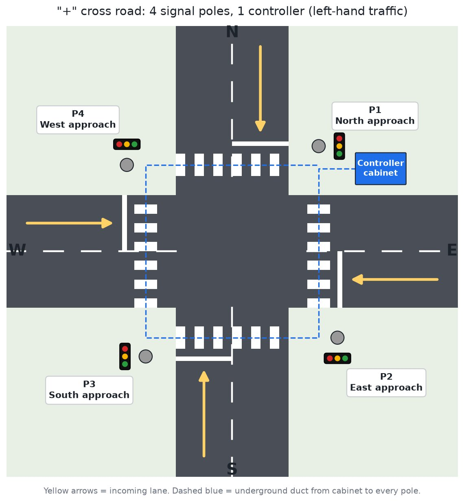
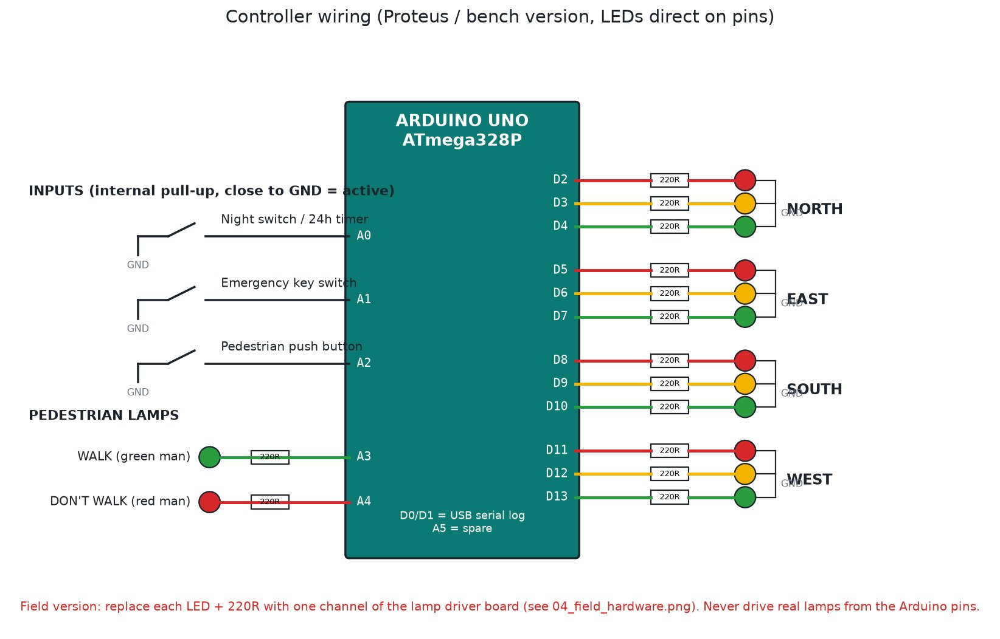
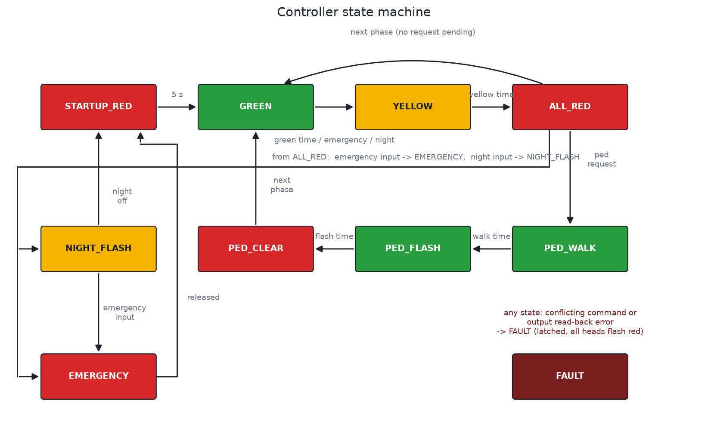
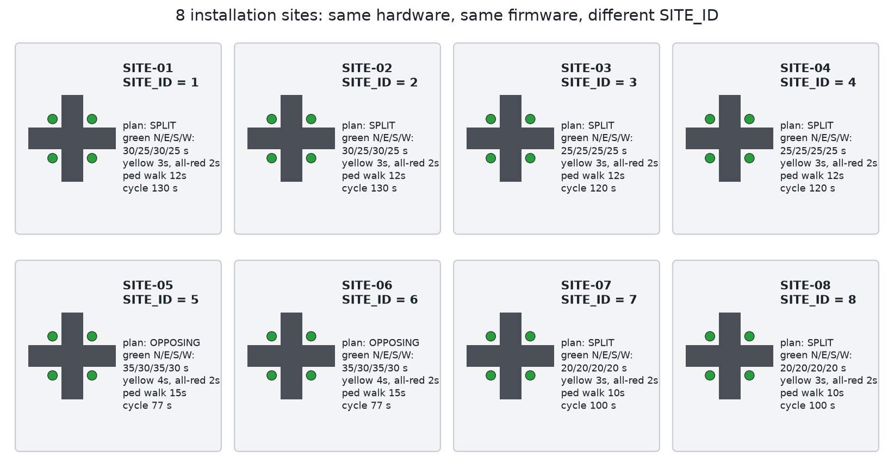

# Proteus Electronics Projects

**15 embedded and electronics projects that solve everyday problems in Nepal**

| | |
|---|---|
| **Client** | Engineering portfolio; projects available for real installations |
| **Type** | Electronics design, embedded firmware, PCB |
| **Years** | 2023–2026 |
| **Status** | Designed, simulated and tested in Proteus; automatic tests in CI |
| **Platform** | Arduino Uno (ATmega328P), 8051, analog circuits |

## The idea

These projects start from problems seen around Nepal: water tanks on every roof, load shedding, LPG in every kitchen, junctions with no signals, windy ridges with no grid, and growing roads that need parking, safe rail crossings and slower traffic. Each microcontroller project comes with its source code, a ready HEX file, wiring diagrams and an automatic simulator test.

### Traffic light controller for 8 real junctions

| Junction layout | Wiring diagram |
|---|---|
|  |  |

| Controller state machine | The 8 sites |
|---|---|
|  |  |

## All projects

| # | Project | What it does |
|---|---|---|
| 01 | 5 V regulated power supply | Transformer, bridge rectifier, 7805; two PCB layouts with 3D view |
| 02 | Op-amp LED flasher | LM741 astable circuit with PCB |
| 03 | SCR latch circuit | Thyristor latch with trigger, reset and metering |
| 04 | 8051 7-segment display | 80C51 multiplexing 8 digits |
| 05 | LED matrix scrolling display | Arduino + MAX7219 chain, message over serial |
| 06 | Gas / smoke detector with SMS | MQ-2 and MQ-3 sensors, SIM900 SMS alerts, exhaust fan, gas valve servo |
| 07 | Traffic light controller, 8 sites | 4-way junction, conflict monitor, pedestrian, night and emergency modes, field install guide |
| 08 | Water tank level controller | 4-level probes, sump dry-run, no-rise and max-run protection, LCD |
| 09 | Smart street light | Light and motion sensors, dusk/dawn filtering, late-night dimming |
| 10 | DC power and energy meter | Volts, amps, watts, Wh, CSV log, over-voltage and short-circuit cut-off |
| 11 | Wind turbine controller | Wind speed, rpm, battery; dump load; fail-safe brake in storms |
| 12 | Wind vane and yaw control | 16-point vane, averaged direction, yaw motor with cable-twist limit |
| 13 | Smart parking system | Per-slot sensors, entry and exit barriers, live slot map |
| 14 | Railway level crossing | Both directions, two trains at once, gateman key, stuck-sensor fault |
| 15 | Vehicle speed detector v2 | Speed, direction, length and class, tailgating, violation log, survey report, live browser demo |

## What each project includes

- Proteus project files
- Arduino source and a ready-to-flash HEX file
- Wiring diagrams and schematics
- An automatic simulator test, run on every change
- For real sites: layout, timing plan, bill of materials and commissioning checklist

---

**Designed by Pradip Subedi · Sprasa Technical Solution**
Need an electronics or control solution? [Get in touch](../README.md#contact).
