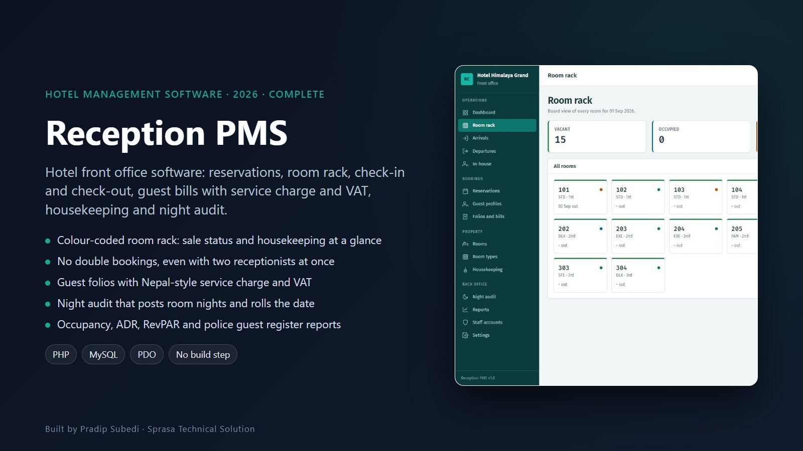
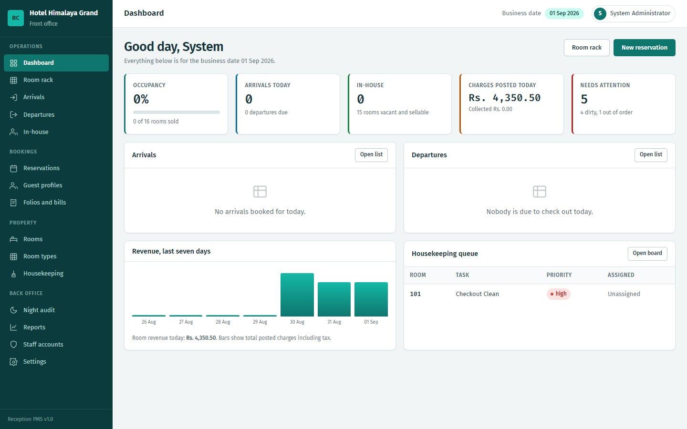
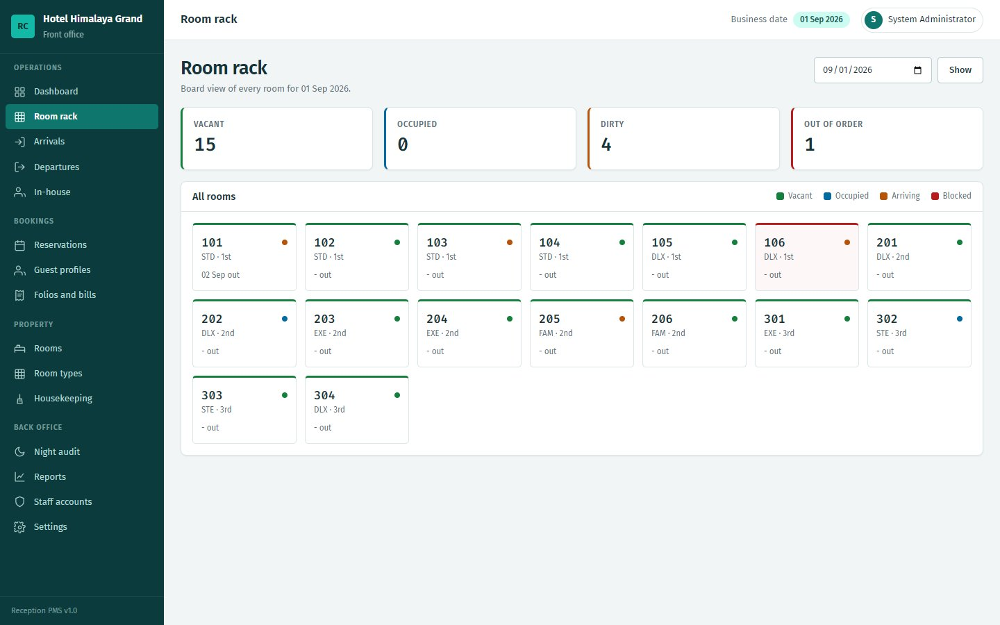
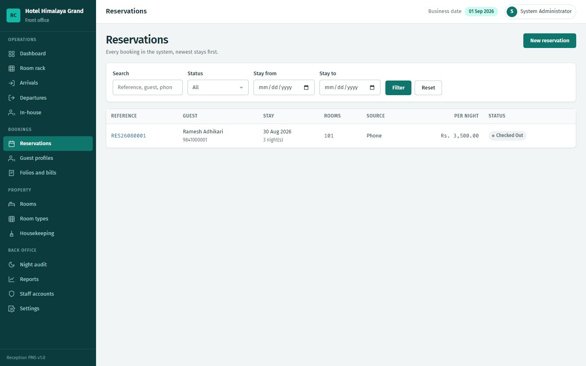
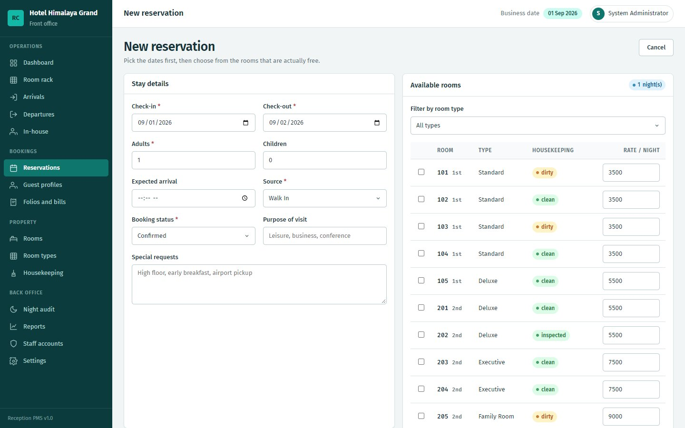
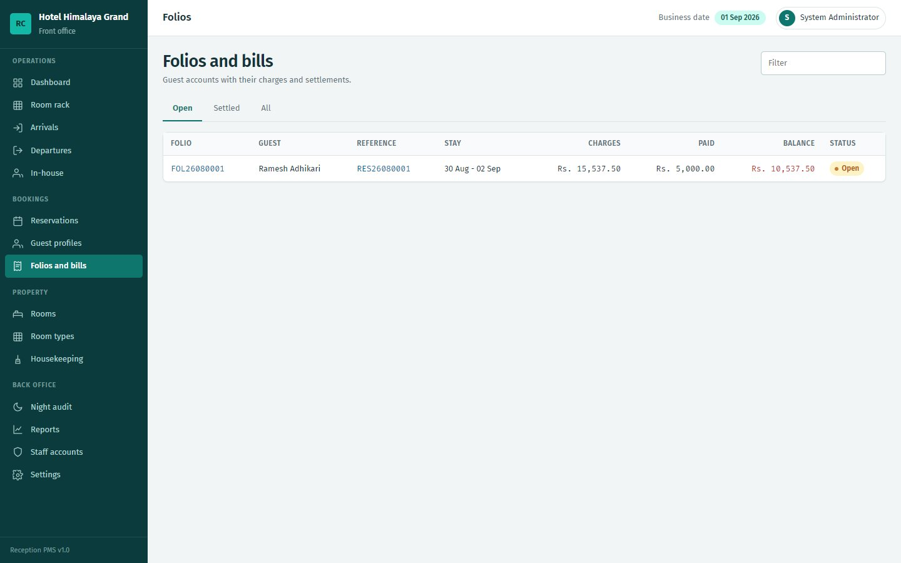
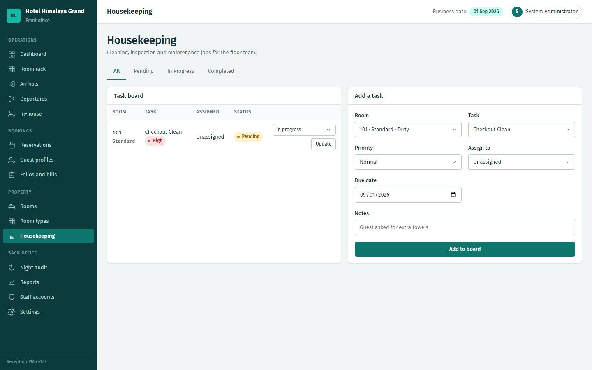
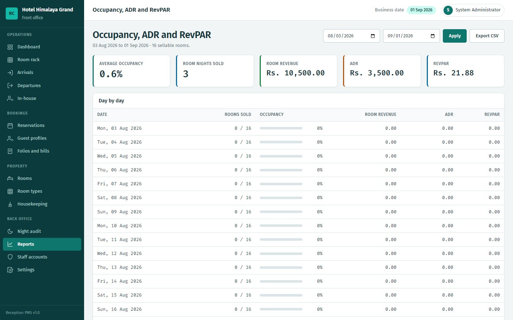
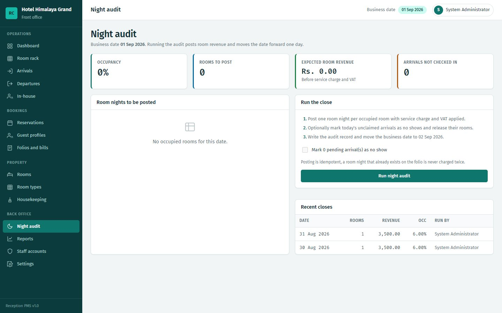

# Reception PMS

**Front office management system for small and mid-size hotels in Nepal**

| | |
|---|---|
| **Client** | Hotels and resorts (demo property: Hotel Himalaya Grand, Chitwan) |
| **Type** | Hotel property management system (PMS) |
| **Year** | 2026 |
| **Status** | Complete |
| **Platform** | Web, runs on XAMPP or any PHP host |

## The problem

Small hotels run the front desk on paper registers and Excel. Rooms get double-sold, bills are worked out by hand (service charge on top, then VAT), housekeeping doesn't know which rooms are free, and the police guest register is copied out every night.

## What we built

One screen for the whole front office: reservations, the room rack, check-in and check-out, guest bills, housekeeping, the nightly close and the reports a hotel in Nepal actually has to file.

### Dashboard and room rack
The dashboard shows occupancy, arrivals, departures, today's charges and what needs attention. The room rack colours every room by sale status and cleaning state.

| Dashboard | Room rack |
|---|---|
|  |  |

### Reservations
Free rooms load as you change the dates. The system checks availability again at the moment of saving, so two receptionists can't sell the same room at the same second.

| Reservations | New reservation |
|---|---|
|  |  |

### Folios, housekeeping and night audit

| Guest folios and bills | Housekeeping board |
|---|---|
|  |  |

| Occupancy, ADR and RevPAR | Night audit |
|---|---|
|  |  |

## Key features

- **Front desk:** arrivals, departures and in-house lists for any date; check-in assigns rooms, blocks blacklisted guests and takes an advance in one step
- **Check-out:** posts any missing room nights, won't let a guest leave with a balance unless a manager moves it to the city ledger, and creates the cleaning task
- **Folios:** charges by category with service charge and VAT calculated the Nepali way; payments, refunds, discounts and voids all leave an audit line; printable invoices
- **Housekeeping:** task board with priority, assignment and status, fed automatically by check-outs
- **Night audit:** posts one room night per occupied room, can mark no-shows and release their rooms, then moves the business date. Running it twice never double-charges
- **Reports:** occupancy, ADR, RevPAR, revenue by category, payment mix, outstanding ledger, audit trail, and the guest register for the local police office with a foreign-national filter. Everything exports to Excel with Nepali names intact
- **Roles:** Admin, Manager, Receptionist, Housekeeping, Accountant

## Technology

| Area | Used |
|---|---|
| Backend | Plain PHP with PDO, small in-house MVC |
| Database | MySQL / MariaDB, 16 tables |
| Security | CSRF, role middleware, prepared statements, audit log |
| Hosting | XAMPP, cPanel or any PHP 7.4+ server; one-click installer |

---

*The screenshots show the demo property and demo data.*

**Built by Pradip Subedi · Sprasa Technical Solution**
Want something similar for your hotel? [Get in touch](../README.md#contact).
