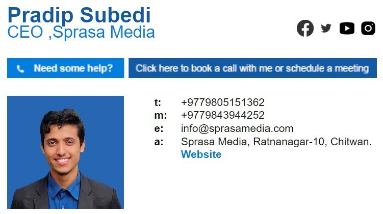

# Small Tools & Web Widgets

**Quick builds that solve one job well**

| | |
|---|---|
| **Client** | Open source and small client jobs |
| **Type** | Widgets, templates and games |
| **Years** | 2023–2025 |
| **Status** | Open source on GitHub |

## Email signature templates

Three professional HTML email signatures with logo, title, contact details and social links. They work in Gmail, Outlook and most other mail apps.

## Digital clock for live streaming

A clean on-screen clock to overlay on live streams and broadcasts (for example in OBS), styled to sit over video.

## Login and sign-up screens

A ready-made login and registration interface that can be dropped into any website.

## Games

- **Snake:** the classic game, written in Python
- **Chess:** a browser chess game

---

**Built by Pradip Subedi · Sprasa Technical Solution**
Need a quick tool or widget? [Get in touch](../README.md#contact).
