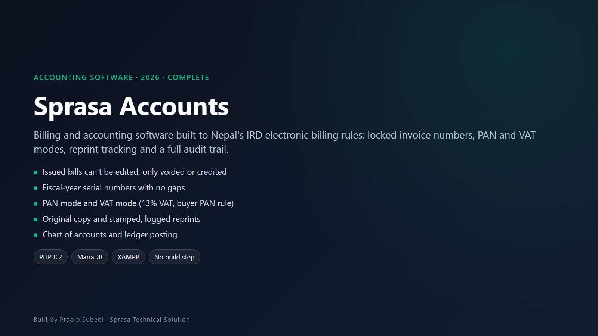

# Sprasa Accounts

**Billing and accounting software built to Nepal's IRD electronic billing procedure**

| | |
|---|---|
| **Client** | Sprasa Technical Solution (in-house); suitable for any Nepali small business |
| **Type** | Billing and accounting software |
| **Year** | 2026 |
| **Status** | Complete |
| **Platform** | Web; runs on a local XAMPP machine with no internet services needed |

## The problem

Nepal's Inland Revenue Department has strict rules for electronic bills: numbers must run without gaps each fiscal year, issued bills can't be changed, every reprint must be marked as a copy, and every action must be traceable to a named person. Spreadsheets and generic invoice apps don't enforce any of that.

## What we built

A billing system where the rules are enforced by the software itself, not left to the user.

## Key features

- **Two worlds for a bill.** A draft is ordinary editable data with no number. Issuing it assigns the next fiscal-year serial, posts it to the ledger and queues it for IRD. After that it can't be edited or deleted, only voided with a reason or reduced with a credit note
- **Gapless numbering.** Serials like `2083/84-0000001` restart each fiscal year and are issued under a database lock, so two people billing at once can never collide or skip a number. A report checks for gaps
- **Reprints.** The first print is the *Original Copy*; every later print is stamped *Copy of Original – N*, watermarked, and logged with who printed it, when and from which machine
- **PAN mode and VAT mode.** In PAN mode documents print as `INVOICE / बीजक`. After VAT registration, one switch changes them to `TAX INVOICE / कर बीजक` with 13% VAT, and a buyer PAN becomes mandatory on bills of Rs 10,000 or more
- **Ready to use.** The installer creates the database, chart of accounts, current fiscal year, a starter catalogue of IT services and the admin account
- **Company setup.** Logo, address, bank details and printed terms; the PAN locks itself after the first bill
- **Users and audit trail.** Every person has their own account and every action is recorded

## Technology

| Area | Used |
|---|---|
| Backend | PHP 8.2, no framework, no Composer |
| Database | MariaDB / MySQL |
| Hosting | XAMPP on an office PC, or any PHP host |

---

*Built to follow the IRD procedure. Confirm your own obligations with your accountant.*

**Built by Pradip Subedi · Sprasa Technical Solution**
Need billing software for your business? [Get in touch](../README.md#contact).
