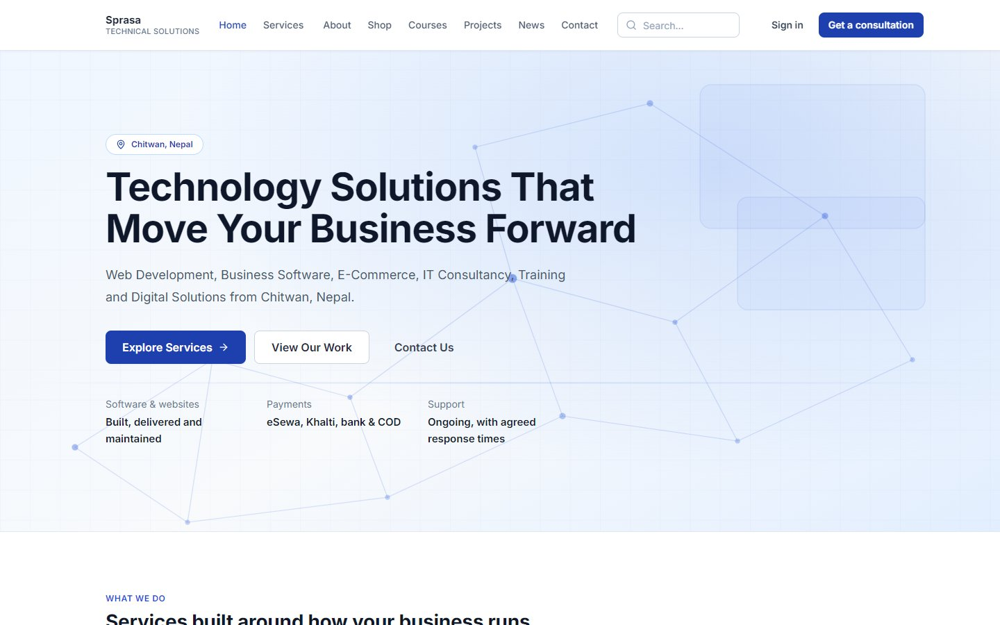
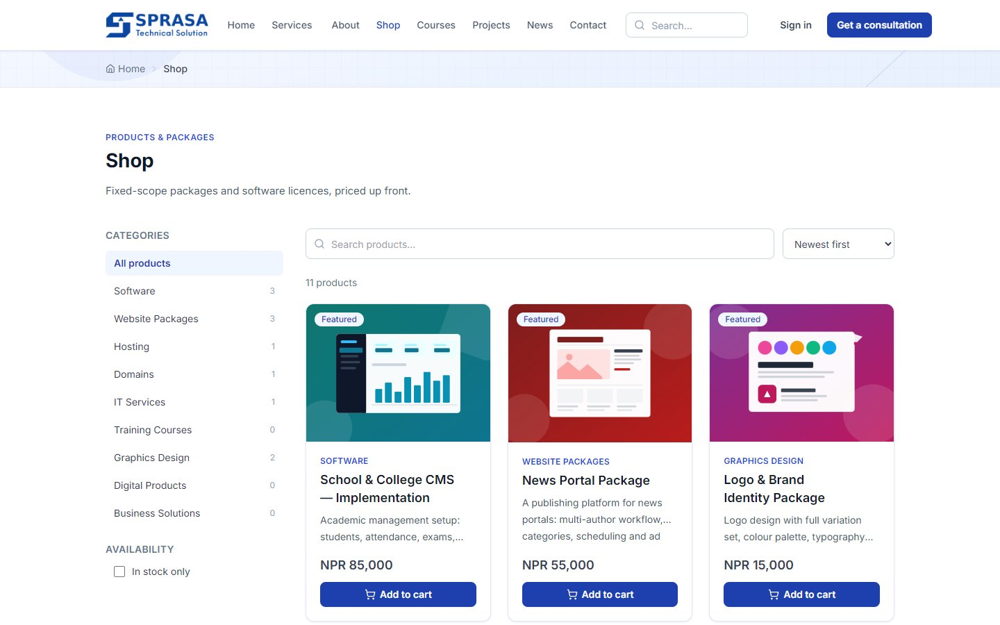
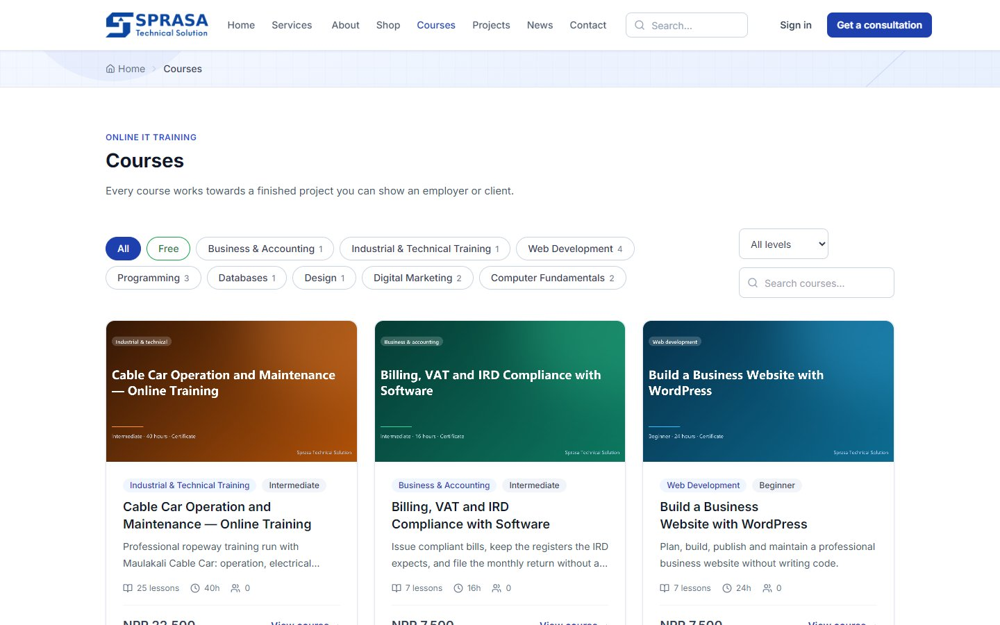
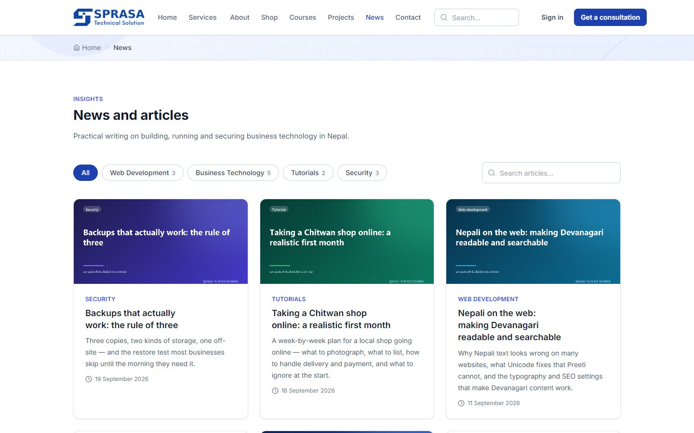
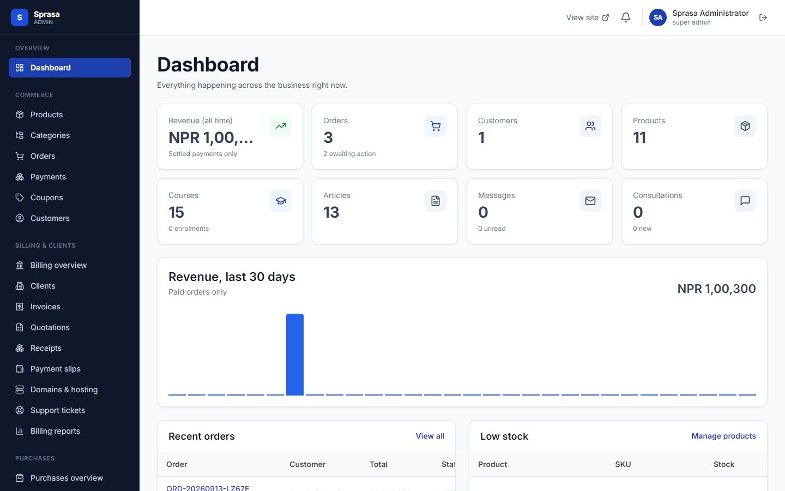
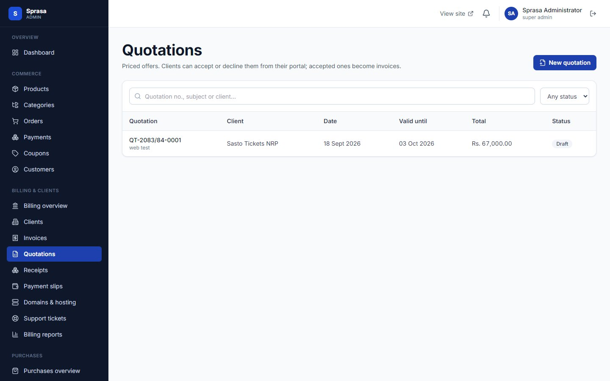
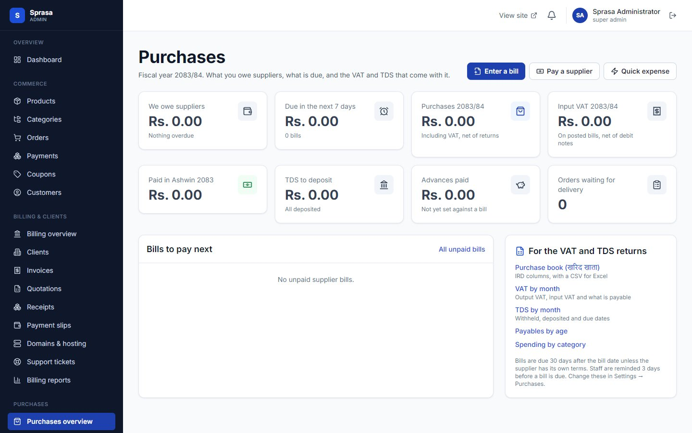
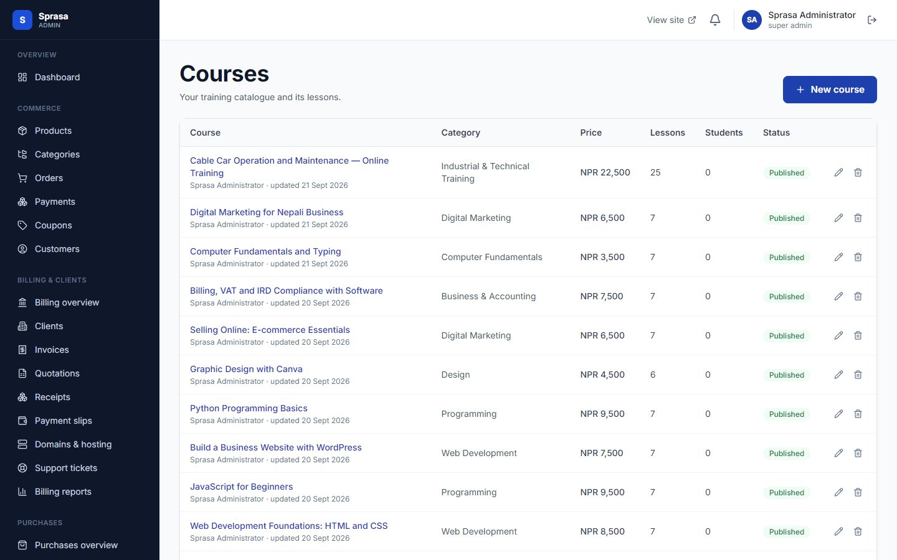

# Sprasa Business Platform

**Website, e-commerce, learning platform, client portal and Nepali billing and accounting, in one system**

| | |
|---|---|
| **Client** | Sprasa Technical Solution, Chitwan (our own platform; adaptable for other IT and service companies) |
| **Type** | Corporate website + e-commerce + LMS + CMS + billing + purchases |
| **Year** | 2026 |
| **Status** | All 26 planned phases complete |
| **Platform** | Web (public site, customer account, client portal, admin) |

## The problem

An IT company sells services, products, hosting, domains and training, and must bill all of it the way Nepal's Inland Revenue Department (IRD) requires. Running that on five separate tools means re-typing data, missed renewals, and invoices that don't follow the rules.

## What we built

One platform where the public website, shop, courses, client portal and accounting share the same data.

### Public website

| Home | Shop |
|---|---|
|  |  |

| Online courses | News and articles |
|---|---|
|  |  |

### Admin

| Dashboard | Quotations |
|---|---|
|  |  |

| Purchases overview | Course management |
|---|---|
|  |  |

## Key features

**Website and content**
- Home, 13 service pages, about, contact, consultancy enquiries, portfolio, news and blog, search
- News CMS with draft, schedule, publish and feature
- Structured data for search engines (Organization, Product, Article, Course, Service, Breadcrumb)

**Shop**
- Products, categories, cart (guest or signed-in, merged at login) and coupons
- Checkout with eSewa, Khalti, bank transfer and cash on delivery; order emails
- Recurring products such as hosting and domains

**Learning (LMS)**
- Course catalogue, enrolment, lesson player with progress tracking
- Quizzes and certificates anyone can verify online

**Billing (built to IRD rules)**
- Bikram Sambat calendar and fiscal years, gapless document numbers
- Invoices go from draft to issued; issued invoices can't be edited or deleted, only corrected with credit notes
- VAT, original and copy prints, receipts with TDS, client payment slips approved by staff
- Quotations that clients accept or decline online and that convert to invoices
- Domain, hosting and service renewals with reminders
- Sales register, VAT summary, receivables, CSV export, optional IRD CBMS sync

**Client portal and support**
- Clients see their invoices, quotations, payments and services
- Support tickets with attachments and internal notes

**Purchases**
- Suppliers with PAN, VAT and bank details
- Purchase orders, partial receiving, supplier bills (including imports), expenses
- Supplier payments with TDS, debit notes, TDS by Nepali month, purchase book in IRD's columns, payables by age

**Platform**
- 7 roles and 84 permissions, login protection and account lockout
- Media library, settings, notifications, audit log
- Money stored and calculated as exact decimals, so invoices never have rounding errors

## Technology

| Area | Used |
|---|---|
| Frontend | React, Vite, TypeScript, Tailwind CSS, TanStack Query |
| Backend | Node.js, Express, TypeScript REST API |
| Database | PostgreSQL with Prisma (41+ tables) |
| Security | Argon2, JWT with refresh rotation, Helmet, rate limiting, HTML sanitising |
| Hosting | Nginx, PM2, backup script, cPanel update package |

---

*Products, courses and figures in the screenshots are sample data.*

**Built by Pradip Subedi · Sprasa Technical Solution**
Want a platform like this for your company? [Get in touch](../README.md#contact).
