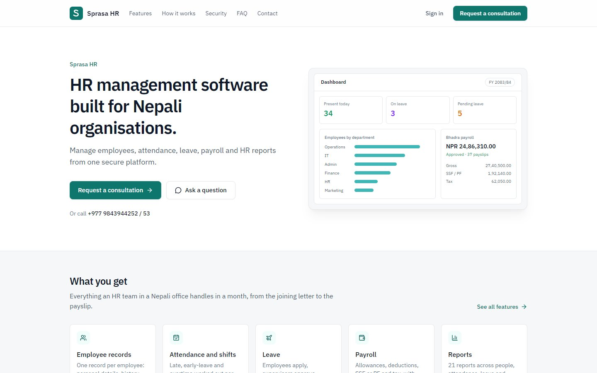
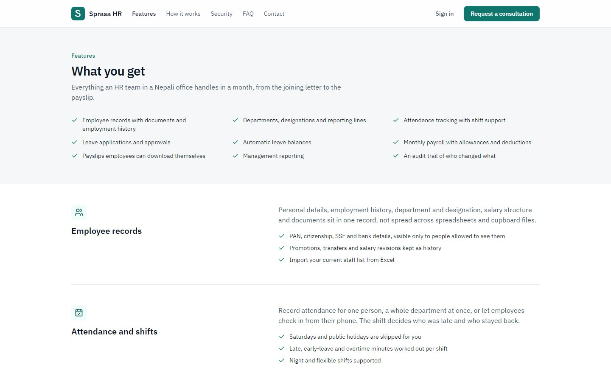
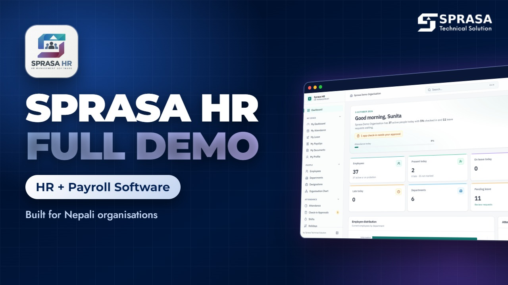
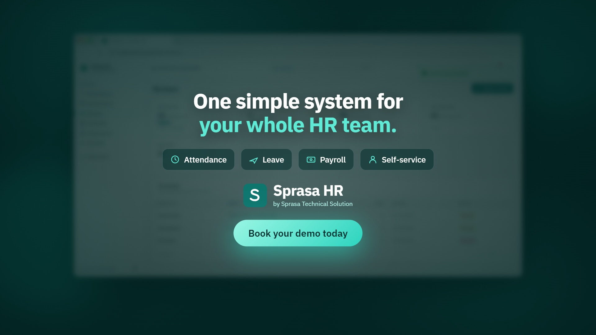

# Sprasa HR

**HR and payroll software built for Nepali organisations**

| | |
|---|---|
| **Client** | Our own product, for companies, schools, hospitals and NGOs in Nepal |
| **Type** | HR and payroll software (SaaS or self-hosted) |
| **Year** | 2026 |
| **Status** | Product, available for demos |
| **Platform** | Web, with a phone layout (bottom tab bar) |

## The problem

Most Nepali offices run HR on Excel: one sheet for staff, another for attendance, and a payroll file that someone rebuilds every month. Leave balances are guessed, tax slabs are copied by hand, and payslips are typed one by one. Foreign HR software doesn't know about SSF, CIT, the Shrawan fiscal year or a Sunday-to-Friday week.

## What we built

Sprasa HR keeps employees, attendance, leave, payroll and reports in one place. It uses NPR, the Asia/Kathmandu timezone, a Sunday-to-Friday week and a fiscal year starting in Shrawan by default, and all of these can be changed in settings.

| Landing page | Features |
|---|---|
|  |  |

| Demo promo | Leave promo |
|---|---|
|  |  |

## Key features

**People**
- Employee records with Nepal-specific fields: PAN, citizenship, SSF / PF / CIT numbers, province, district, municipality
- Departments, designations, reporting lines and an organisation chart
- Employment history written automatically on joining, transfer, promotion, salary change and exit
- Documents with expiry tracking
- Import from Excel or CSV; the whole file is checked first and nothing is imported if any row has an error

**Attendance**
- Shifts with grace periods, breaks, overnight hours and flexible options
- Late, early-leave and overtime minutes worked out per person
- One-by-one, bulk department entry, or employee self check-in
- Holiday calendar that feeds working-day counts everywhere

**Leave**
- Annual, sick, casual, maternity, paternity, unpaid and your own types
- Pro-rated entitlement, carry-forward caps and half days
- Employee applies → supervisor approves → HR gives final approval where needed
- Overlapping or impossible requests are rejected; approved leave marks attendance automatically

**Payroll**
- Salary components and reusable structures; salary changes are effective-dated, so old payroll never changes
- Bonus, commission, loan instalments and advance recovery
- Deducts unpaid leave and absence, adds overtime, caps retirement contributions, applies progressive tax slabs with SSF options
- Draft → Reviewed → Approved → Paid; approval locks the figures and issues payslips (PDF, print and self-service)

**Reports and platform**
- 21 reports: headcount, joiners, exits, turnover, attendance, late arrivals, overtime, leave, payroll register, tax summary and more; export to CSV, Excel and PDF
- Roles: Super Admin, HR Admin, HR Officer, Manager, Accountant, Employee and custom roles, each limited to the whole organisation, their team or themselves
- Audit log, email and in-app notifications, several organisations per install, light and dark themes, Nepali translation started

## Technology

| Area | Used |
|---|---|
| Web app | React 19, TypeScript, Vite, Tailwind CSS 4, TanStack Query, Recharts |
| API | Node.js, Express 5, TypeScript, Prisma, Zod, JWT with rotating refresh |
| Database | PostgreSQL |
| Files | PDF payslips (PDFKit), Excel import/export (ExcelJS) |
| Ops | Docker Compose, Nginx, scheduled backups |

---

*Tax slabs and contribution rates ship as sample settings and must be checked by an accountant before real payroll.*

**Built by Pradip Subedi · Sprasa Technical Solution**
Want a demo for your organisation? [Get in touch](../README.md#contact).
