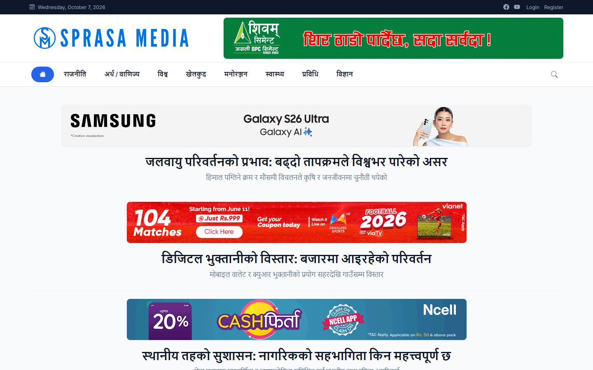
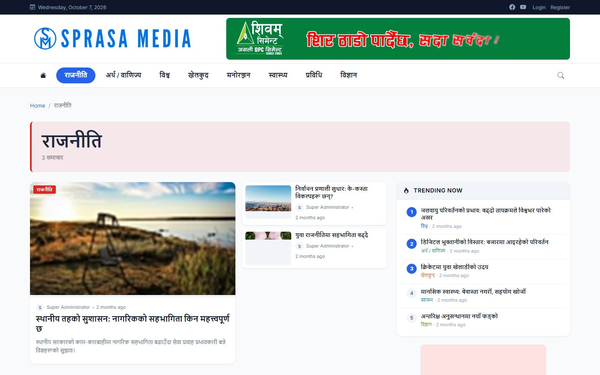
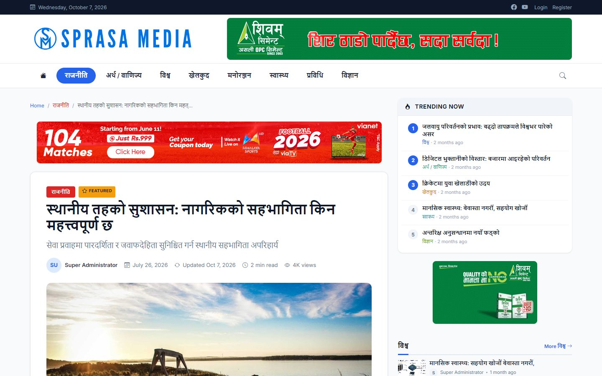
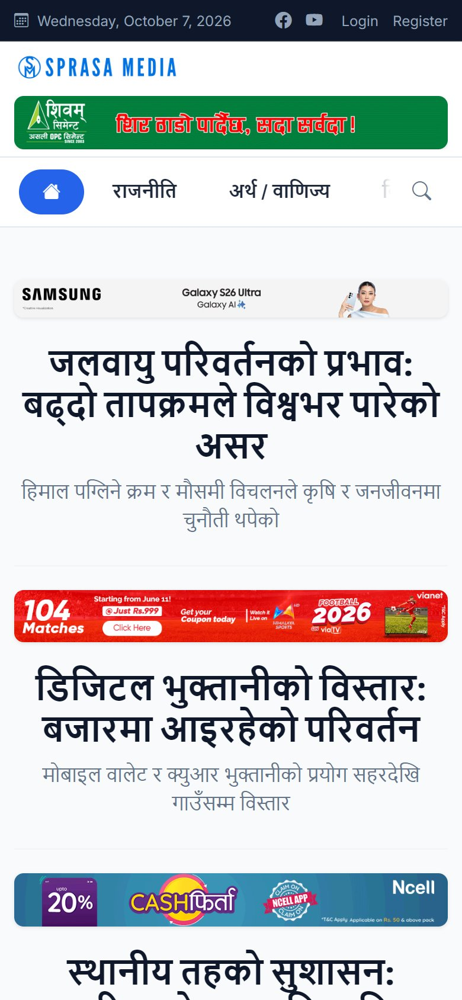
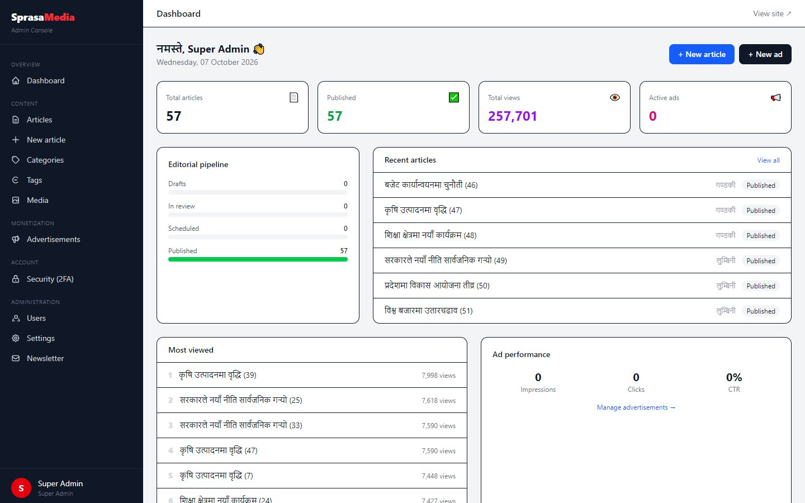
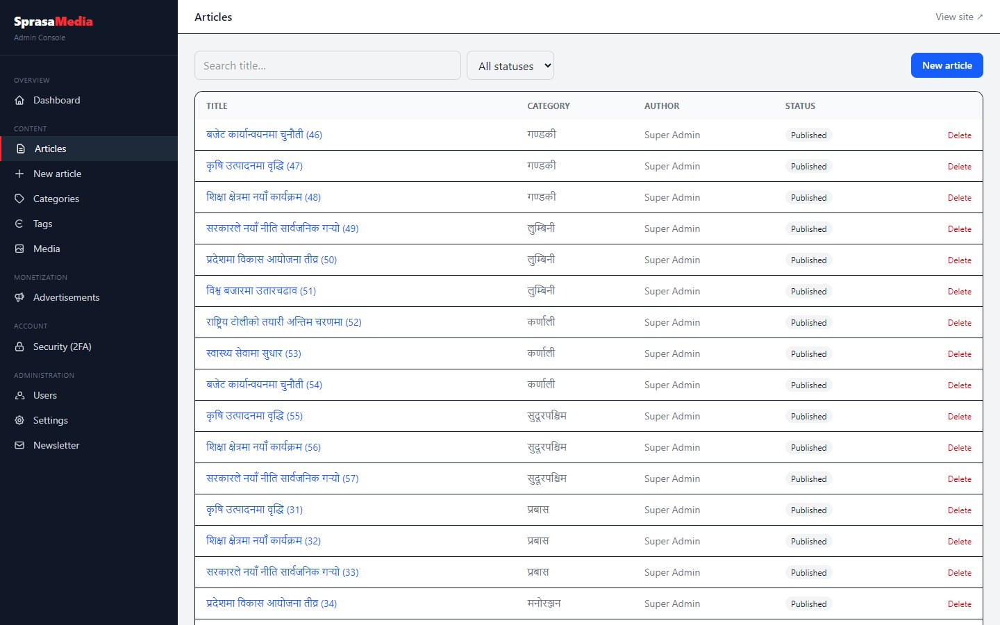
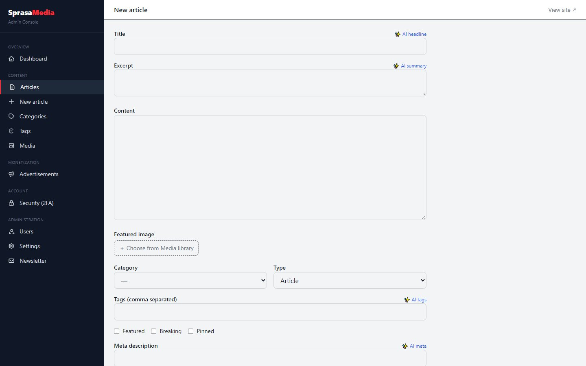

# Sprasa Media News CMS

**A complete platform for running a Nepali news portal**

| | |
|---|---|
| **Client** | Sprasa Media; the same platform was rebranded for Fastkhabar Online |
| **Type** | News portal + newsroom CMS + advertising system |
| **Year** | 2026 |
| **Status** | Complete (12 phases) |
| **Platform** | Web, installable as a phone app (PWA) |

## The problem

Nepali news portals usually run on a WordPress theme with plugins bolted on. They get slow under traffic, ads are hard to manage, and editors have no proper workflow. Publishers wanted a fast portal with a real newsroom behind it, and ad income they can measure.

## What we built

A news platform with an editorial workflow, a full ad engine, AI helpers for editors, and a fast reader experience in Nepali.

### Reader site

| Home page | Category page |
|---|---|
|  |  |

| Article | On a phone |
|---|---|
|  |  |

### Newsroom admin

| Dashboard | Articles |
|---|---|
|  |  |

## Key features

**Newsroom**
- Draft → review → publish workflow with publishing rights by role
- Scheduled publishing, autosave, revision history with restore
- Categories, sub-categories (province mega-menu), tags and a media library
- Roles: super admin, admin, editor, reporter, contributor, author, subscriber

**AI tools for editors** (work with any AI provider, and switch off cleanly without a key)
- Headline, summary, meta description and tag suggestions
- Rewrite, draft generation and translation
- Fact-check hints and comment moderation
- "Related articles" recommendations

**Advertising**
- One ad engine for every placement: AdSense, custom HTML, image and video ads
- Targeting by category and device, scheduling, weighted A/B rotation
- Impressions, clicks, CTR and estimated revenue; between-paragraph ads

**Reader experience**
- Breaking news ticker, hero, latest feed with "load more", category blocks
- Most read, and trending based on real view speed over the last 24 hours
- Comments with moderation, and emoji reactions
- Newsletter with confirmed sign-up

**Speed, SEO and app**
- Cached homepage, old-URL redirects preserved
- News sitemap, RSS, structured data
- Installable app with offline reading
- Public JSON API for articles and categories
- Two-factor login for staff

## Technology

| Area | Used |
|---|---|
| Backend | Laravel 12 (PHP) with service layer and policies |
| Admin UI | Livewire, Tailwind CSS |
| Database | MySQL, Redis-ready caching |
| App | PWA: manifest, service worker, offline page |
| Also built | A lighter plain-PHP version of the CMS for shared hosting |

---

*Articles and ads in the screenshots are demo content.*

**Built by Pradip Subedi · Sprasa Technical Solution**
Want a news portal like this? [Get in touch](../README.md#contact).
