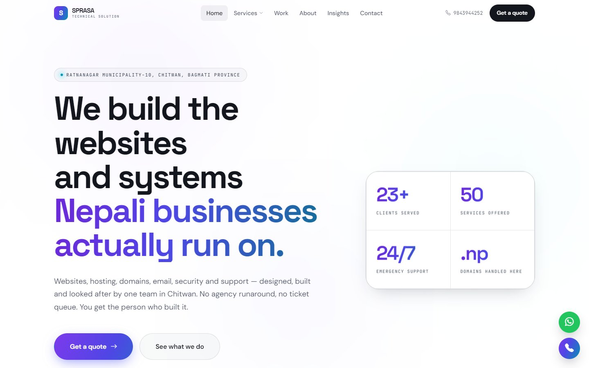
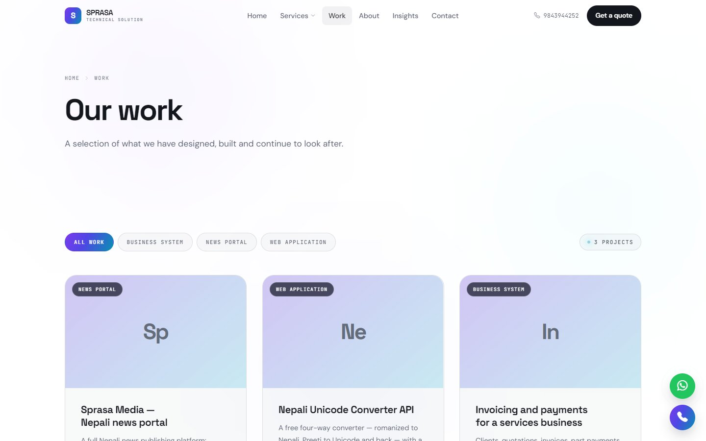
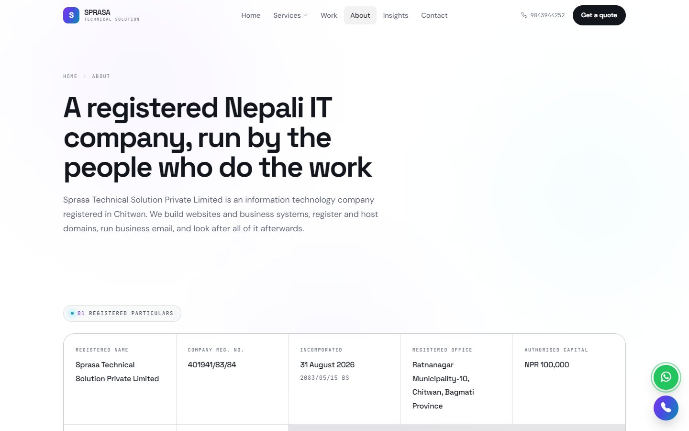
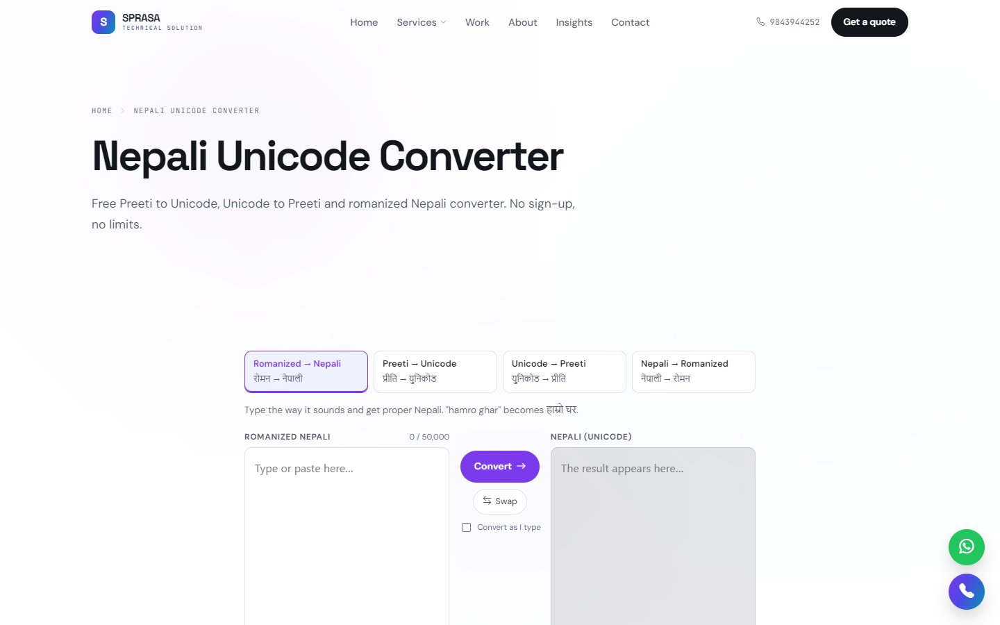
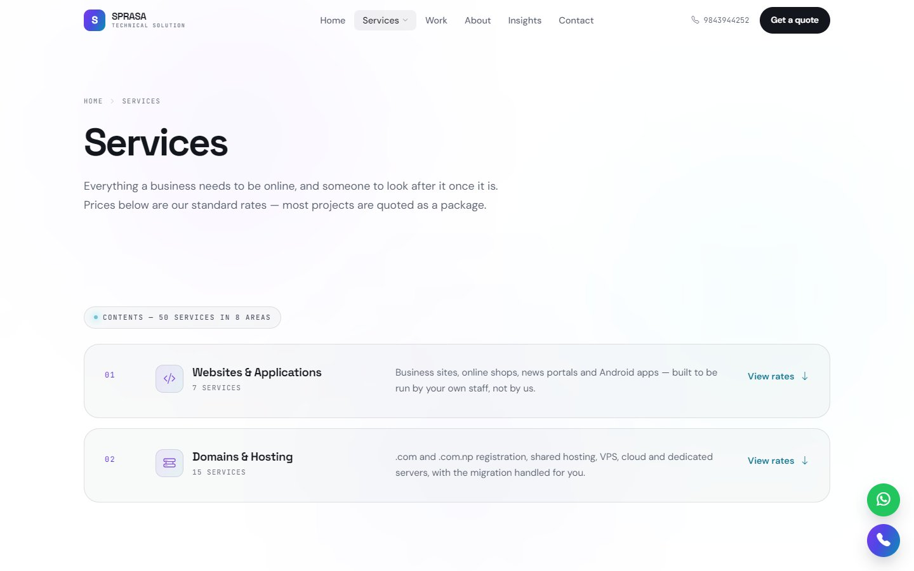
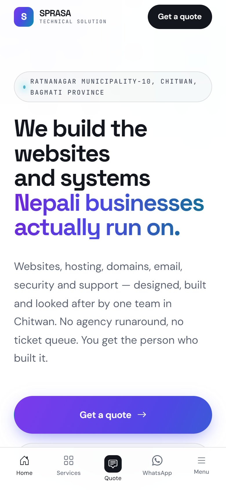

# Sprasa Technical Solution Website

**Our company website and the back office that runs the business**

| | |
|---|---|
| **Client** | Sprasa Technical Solution Pvt. Ltd., Ratnanagar-10, Chitwan (Reg. No. 401941/83/84) |
| **Type** | Company website + sales and billing back office |
| **Year** | 2026 |
| **Status** | Live at [sprasatechnicalsolution.com.np](https://sprasatechnicalsolution.com.np) |
| **Platform** | Web, cPanel hosting |

## The idea

One application does two jobs. The public half sells the work; the private half runs the business that follows: enquiries, quotations, invoices, payments, expenses and renewals. They share one database, so when a price changes in billing, the website shows the new price straight away.

### Public website

| Home | Our work |
|---|---|
|  |  |

| About (with full company registration) | Free Nepali Unicode converter |
|---|---|
|  |  |

| Services and rate card | On a phone |
|---|---|
|  |  |

## Key features

**Public site**
- Home: services, why us, work, process, testimonials and latest posts
- Full rate card read live from billing
- Portfolio with case studies, about page with team and registration details, FAQ
- Contact form that lands in the admin's enquiries
- Blog ("Insights") with topics and a mailing list
- Free Preeti ⇄ Unicode Nepali converter
- `/pay/{link}`: clients pay an invoice by eSewa or Khalti without logging in
- `/proposal/{link}`: clients open a quotation and accept or decline it
- Sitemap, robots.txt and RSS feed generated automatically

**Back office**
- Sales and billing: enquiries, quotations, invoices, payments, expenses, clients, rate card, renewals, reports, payment gateways, invoice design
- Website: home page, company profile, portfolio, testimonials, team, FAQ, pages, menus, media
- Users, analytics, SEO tools, audit log and settings
- A read-only public API for services, projects and posts, plus an enquiry endpoint
- Health checks that test every page and the install before each deploy

## Technology

| Area | Used |
|---|---|
| Backend | PHP 8.2, small in-house MVC, no build step |
| Database | MySQL / MariaDB |
| Payments | eSewa, Khalti |
| Ops | One cron entry drives all scheduled work |

---

**Built by Pradip Subedi · Sprasa Technical Solution**
[Get in touch](../README.md#contact).
