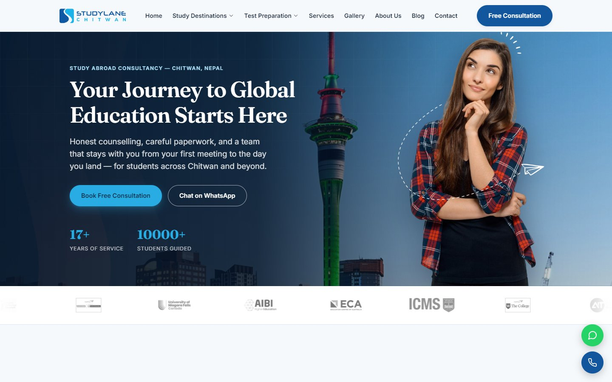
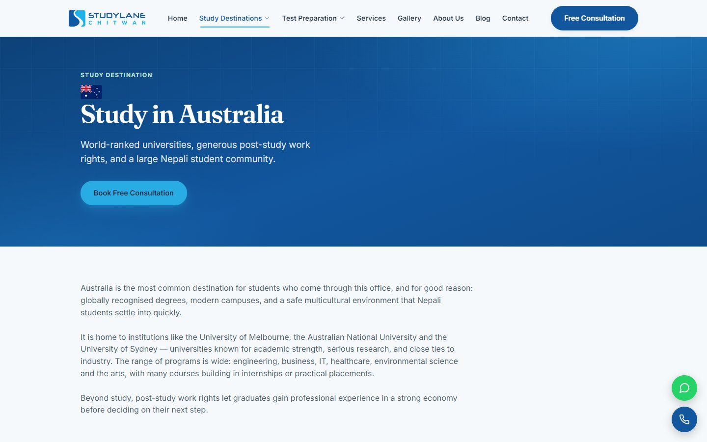
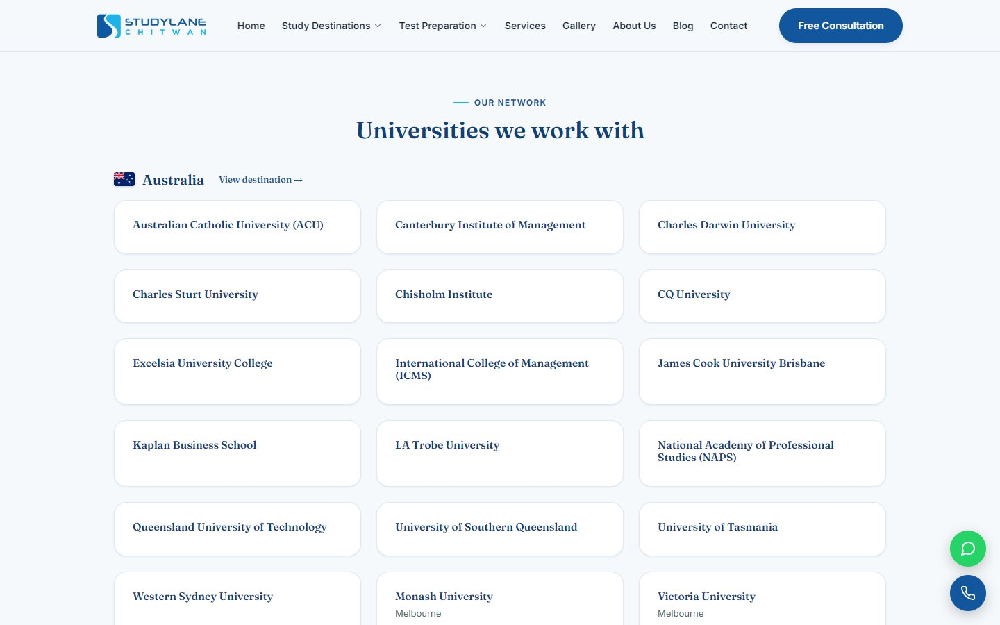
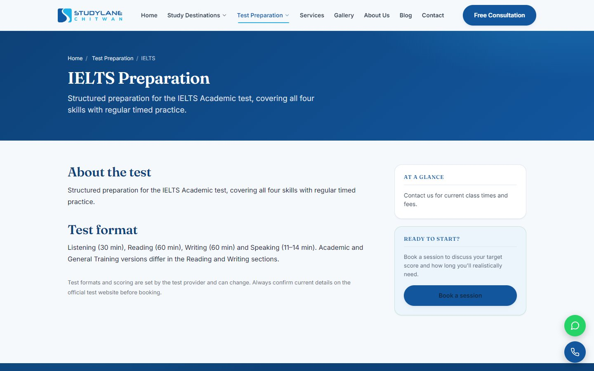
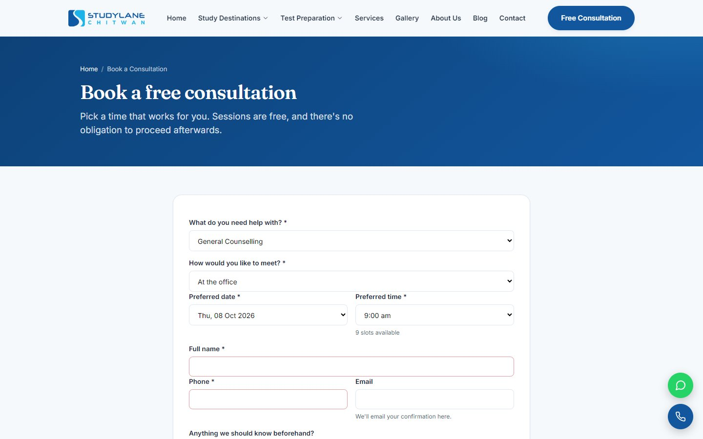
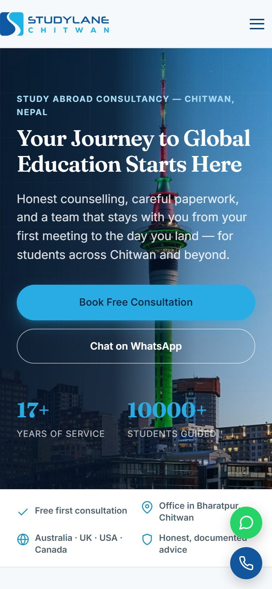

# Study Lane Chitwan

**Study-abroad consultancy website, CMS and student CRM**

| | |
|---|---|
| **Client** | Study Lane Chitwan, Bharatpur, Chitwan |
| **Type** | Education consultancy website + CMS + CRM |
| **Year** | 2026 |
| **Status** | Complete |
| **Platform** | Web, runs on ordinary cPanel shared hosting |

## The client's problem

A study-abroad consultancy lives on enquiries. Leads came from Facebook, phone calls and walk-ins and were tracked in notebooks and spreadsheets. Students' documents and application progress were scattered, and the old website didn't bring in enquiries from Google.

## What we built

A public website that turns visitors into enquiries, and a private admin that follows each student from first call to visa.

### Website

| Home | Study destination |
|---|---|
|  |  |

| Partner universities | Test preparation |
|---|---|
|  |  |

| Book a free consultation | On a phone |
|---|---|
|  |  |

## Key features

**Public website**
- Home page sections the staff control from the admin
- Study destinations (Australia, UK, USA, Canada, New Zealand) and partner universities
- Course finder, scholarships, IELTS / PTE / TOEFL preparation pages
- Blog, success stories, testimonials, events, FAQs and gallery
- Consultation booking with real free slots, free assessment form, site search
- WhatsApp and call buttons on every page; branded error pages and maintenance mode

**Admin and CRM**
- Dashboard with live figures and charts
- Leads/CRM, students, and applications with a status timeline
- Document management for each student
- Appointments, messages, notifications and global search
- Blog, pages, services, events, scholarships, partners, FAQs, media library
- Menu manager and homepage section manager
- Settings in 9 tabs, users with detailed permissions, activity log

**SEO**
- Titles, descriptions and canonical tags per page
- Open Graph and Twitter cards
- Structured data: Organization, Breadcrumb, BlogPosting, FAQPage, Event, Course
- `sitemap.xml` and `robots.txt` generated from the database
- An on-page SEO checklist in the blog and page editors

## Technology

| Area | Used |
|---|---|
| Backend | Plain PHP 8.2, no framework, no build step |
| Database | MySQL / MariaDB, tracked migrations |
| Security | Prepared statements, CSRF tokens, login lockout, HTML sanitising, safe uploads |
| Hosting | Any cPanel shared host |

## Results for the client

- Every enquiry lands in one place with its source and follow-up date
- Counsellors see each student's documents and application stage at a glance
- Staff publish blog posts and pages without a developer

---

**Built by Pradip Subedi · Sprasa Technical Solution**
Want something similar for your business? [Get in touch](../README.md#contact).
