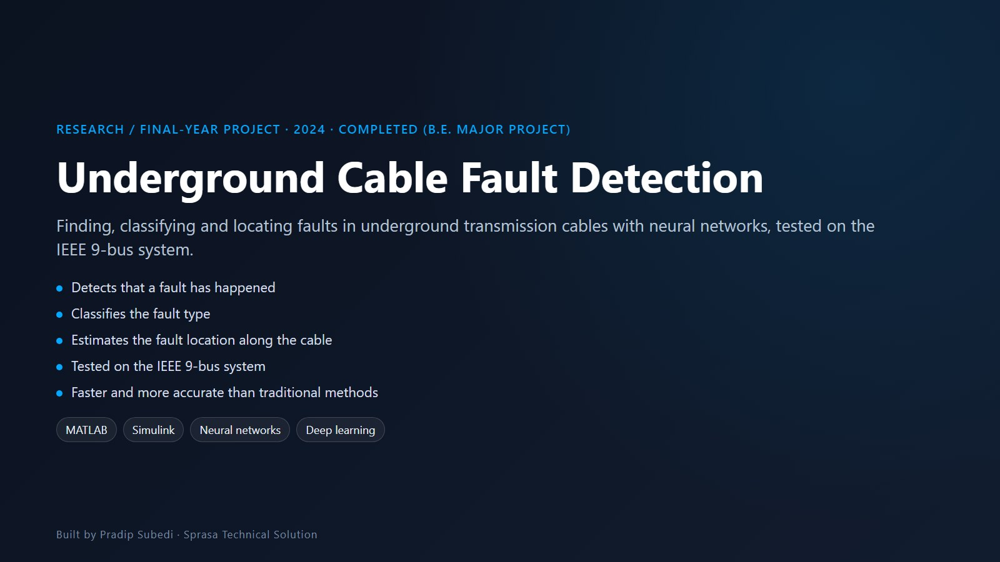

# Underground Cable Fault Detection Using Neural Networks

**Detecting, classifying and locating faults in underground transmission cables**

| | |
|---|---|
| **Institution** | United Technical College, Bharatpur (Pokhara University) |
| **Type** | Bachelor of Engineering major project, Electrical & Electronics |
| **Year** | July 2024 |
| **Team** | Bishad Upadhyay, Narayan Bahadur Rana, Pradip Subedi, Sneha Kumari Singh, Subash Sharma |
| **Supervisor** | Er. Sudeep Thapaliya |

## The problem

When an underground cable fails, finding exactly where is hard. Crews often have to dig up long stretches of cable to check it, which is slow, expensive and leaves customers without power.

## What we built

A system that analyses the electrical signals on the line and uses neural networks to:

1. **Detect** that a fault has occurred
2. **Classify** the fault type
3. **Locate** the fault along the cable

The current changes depending on how far along the cable the fault is, and the trained network learns that relationship from simulated data.

## How it was tested

- The power network was modelled in MATLAB / Simulink
- The method was tested on the standard **IEEE 9-bus system**
- It showed better speed and accuracy than traditional methods

## Why it matters

- Crews dig in the right place first time
- Power is restored faster
- Distribution networks become more reliable

**Keywords:** fault detection, fault classification, fault location, neural networks, MATLAB simulation, IEEE 9-bus system, deep learning

---

**Pradip Subedi · Sprasa Technical Solution**
Need power-system analysis or simulation? [Get in touch](../README.md#contact).
