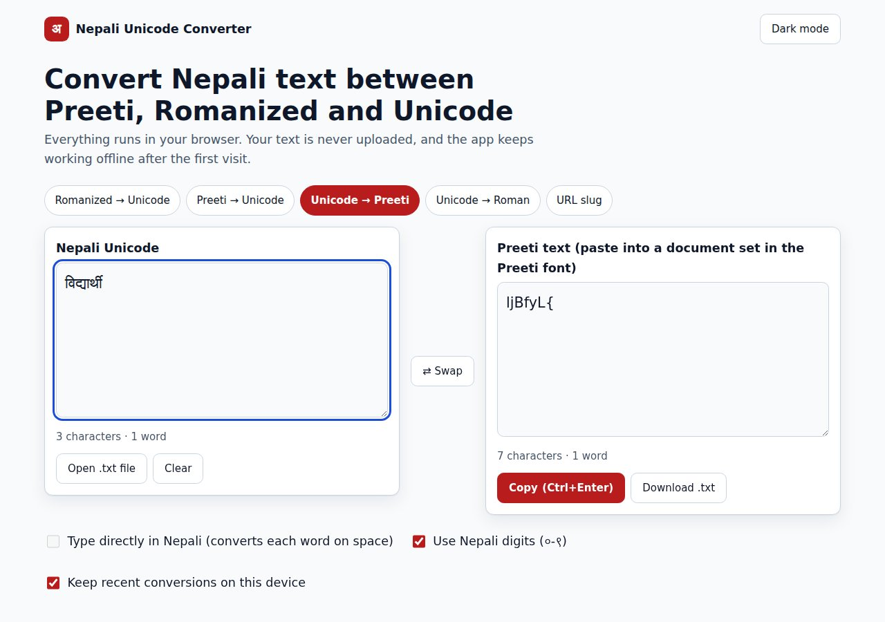
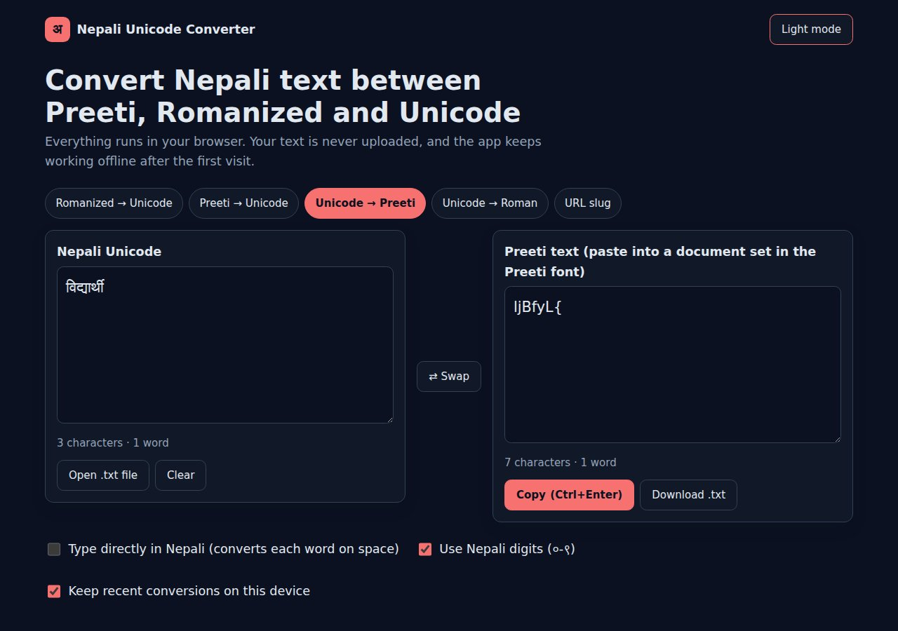
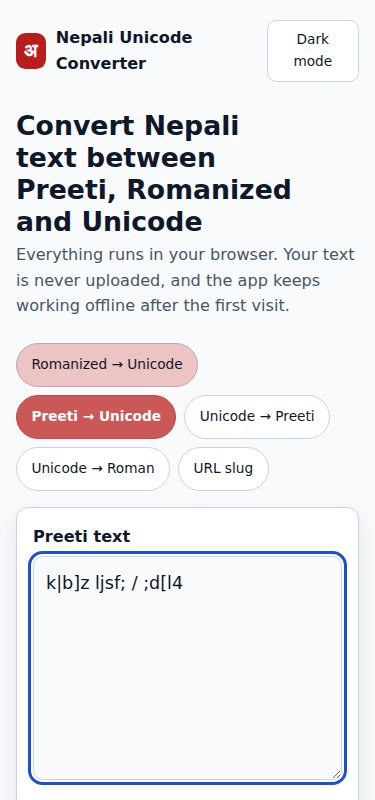
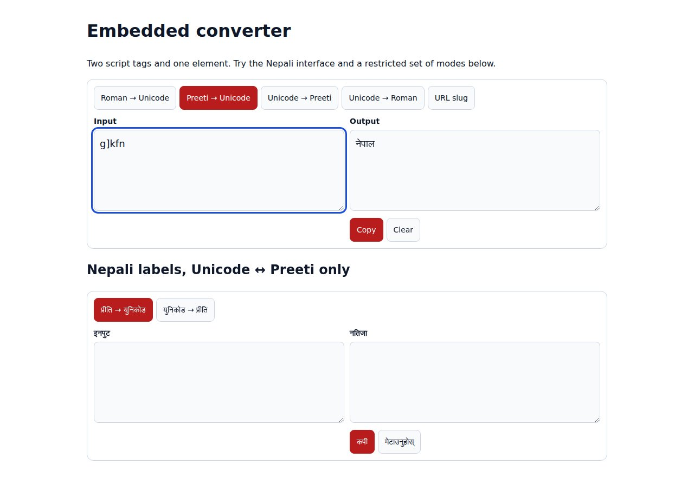

# Nepali Unicode Converter

**Convert Nepali text between Preeti, Romanized and Unicode, anywhere**

| | |
|---|---|
| **Client** | Open source, for Nepali writers, offices, publishers and developers |
| **Type** | Web app + library + WordPress plugin |
| **Year** | 2026 |
| **Status** | Version 2.0.0, open source on [GitHub](https://github.com/sprasapradip/unicode-nepali) |
| **Platform** | Browser, Node.js, PHP / Laravel, WordPress, command line |

## The problem

Many Nepali offices still type in the old Preeti font, which looks like Nepali but is stored as English letters, so it can't be searched, shared or published online. Converting it by hand is slow, and most online converters get conjunct letters wrong and upload your text to a server.

## What we built

One small library with no dependencies that does the conversion correctly everywhere, entirely on the user's own device.

| Light theme | Dark theme |
|---|---|
|  |  |

| On a phone | Embedded on another website |
|---|---|
|  |  |

## Key features

| Feature | Details |
|---|---|
| Preeti → Unicode | Reorders ि and reph (र्), joins half forms, handles conjuncts (क्ष, त्र, ज्ञ, द्य, श्र) and Preeti digits |
| Unicode → Preeti | Exact key sequence for documents set in Preeti, round-trips back cleanly |
| Romanized → Unicode | Phonetic typing (`namaste` → नमस्ते, `xetra` → क्षेत्र) |
| Type in place | Each word converts as you press space |
| URL slugs | `नेपालको राजनीतिक समाचार` → `nepalko-rajnitik-samachar` for WordPress and Laravel |
| Numbers | Nepali digits both ways and lakh/crore grouping: `1234567.5` → `१२,३४,५६७.५` |
| Auto-detect | Spots text pasted into the wrong mode and offers to switch |
| Web app | Open/download files, copy, swap, history, dark mode, works offline |
| Embed | `<nepali-converter>` widget for any website |
| PHP / Laravel | Gives byte-identical output to the JavaScript version |
| WordPress | `[nepali_converter]` shortcode and English slugs for Nepali post titles |
| Command line | `nepali-convert preeti-to-unicode old.txt -o new.txt` |

## Technology

| Area | Used |
|---|---|
| Core | Plain JavaScript, zero dependencies |
| Ports | PHP class, WordPress plugin, Node CLI |
| App | Progressive web app |
| Quality | Automated tests in CI |

---

**Built by Pradip Subedi · Sprasa Technical Solution**
Need Nepali language tools on your site? [Get in touch](../README.md#contact).
