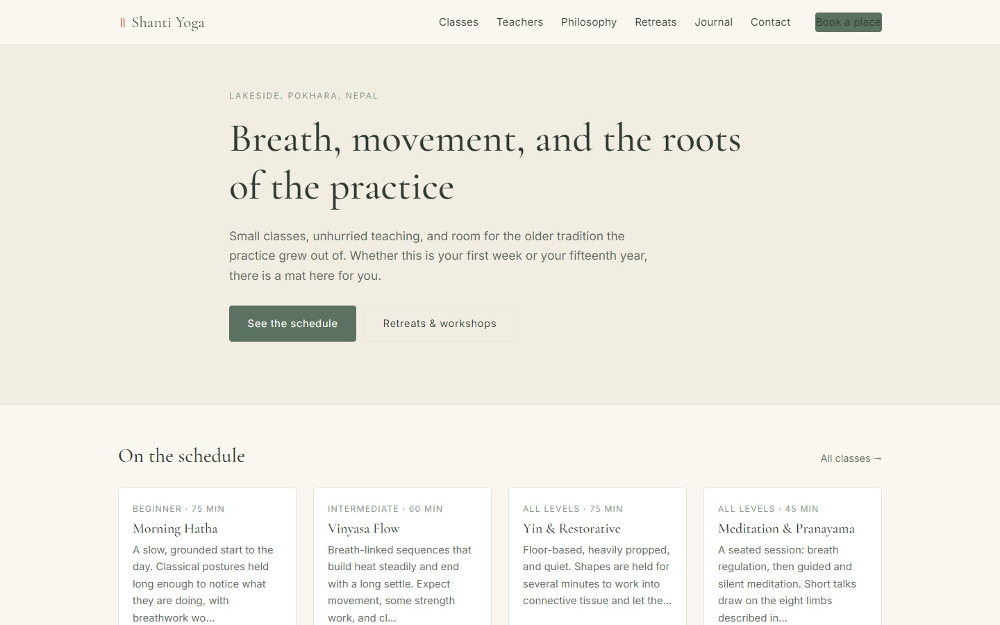
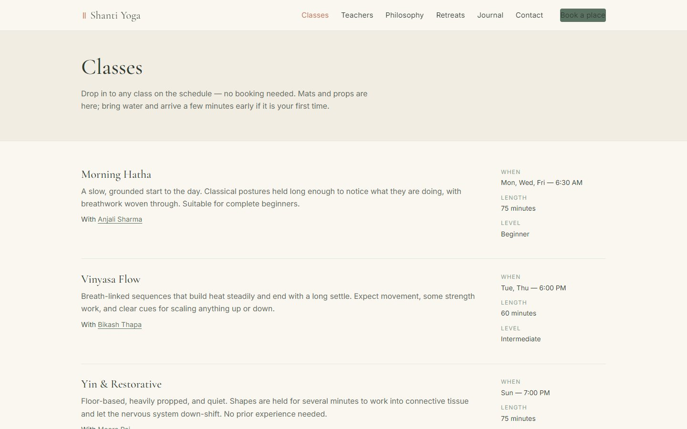
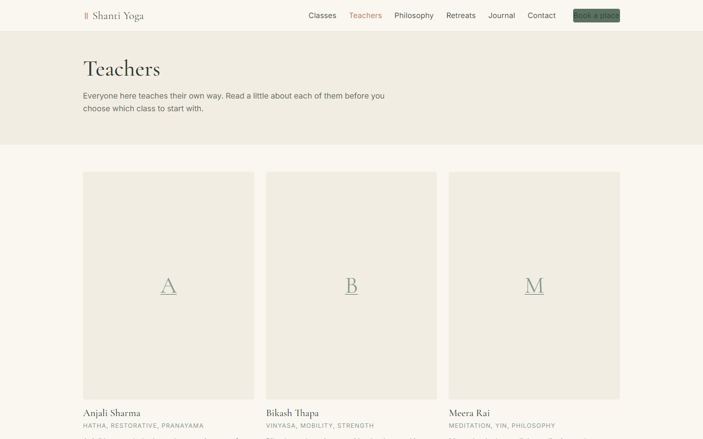
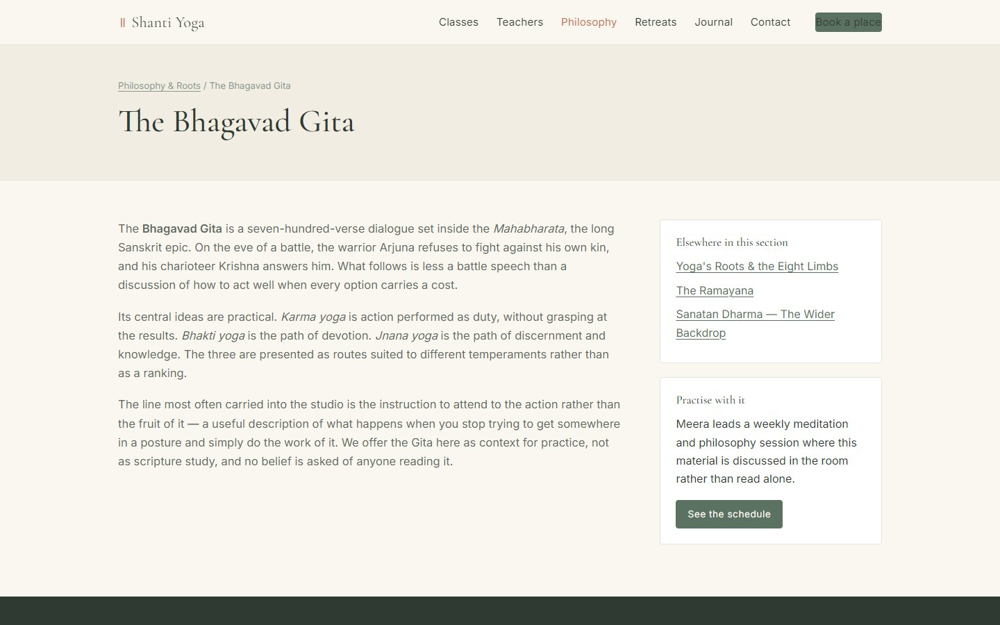
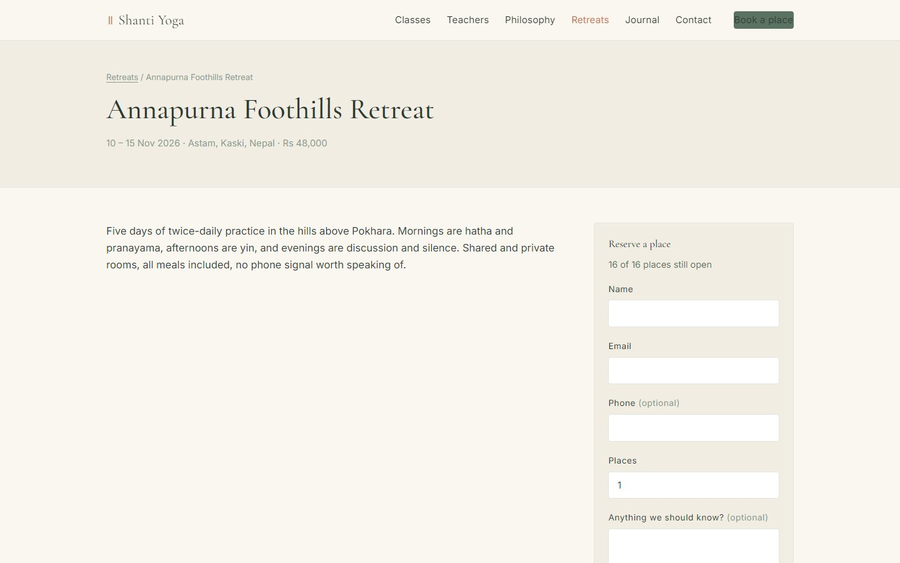
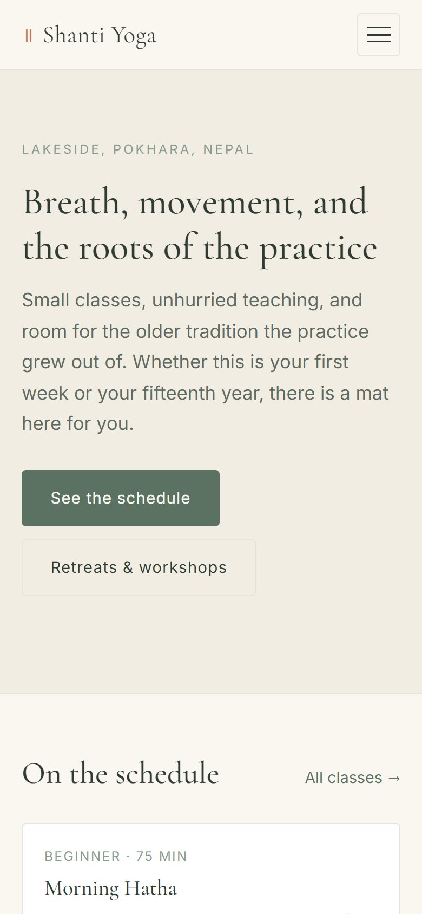

# Shanti Yoga Studio

**Website and admin panel for a yoga studio, with classes, teachers, retreats and seat booking**

| | |
|---|---|
| **Client** | Yoga studio, Lakeside, Pokhara (brand: Shanti Yoga) |
| **Type** | Business website + CMS + retreat booking |
| **Year** | 2026 |
| **Status** | Complete |
| **Platform** | Web, runs on cPanel shared hosting |

## The client's problem

The studio wanted a site that feels like the studio itself: quiet and unhurried. It also needed the class timetable and retreats to stay up to date without calling a developer, and retreat seats to be reserved online.

## What we built

A calm, mobile-first website with a sage and cream palette, and a simple admin panel behind it.

| Home | Class schedule |
|---|---|
|  |  |

| Teachers | Philosophy: the Bhagavad Gita |
|---|---|
|  |  |

| Retreat with seat booking | On a phone |
|---|---|
|  |  |

## Key features

- Class schedule with day, time, duration, level and teacher
- Teacher profiles with specialties
- Four philosophy pages (Yoga roots, Bhagavad Gita, Ramayana, Sanatan Dharma), written in an educational tone
- Retreats with dates, price and a live "places left" count; visitors reserve seats online and get a booking code
- Journal (blog) and a contact form that lands in the admin inbox
- Admin: classes, teachers, pages, blog, retreats, bookings, messages, media library and site settings
- Clean URLs, CSRF protection on every form, all text editable from settings

## Technology

| Area | Used |
|---|---|
| Backend | PHP 8, hand-built MVC, no framework |
| Database | MySQL (InnoDB, utf8mb4) |
| Hosting | Upload to cPanel; no build step |

---

*Teachers, classes and retreats in the screenshots are demo content.*

**Built by Pradip Subedi · Sprasa Technical Solution**
Want something similar for your business? [Get in touch](../README.md#contact).
